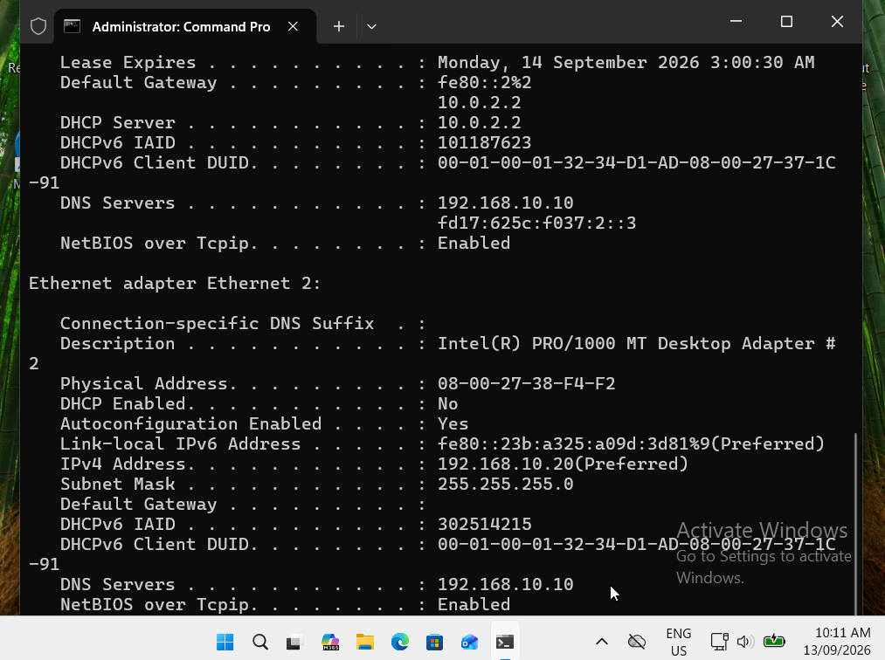
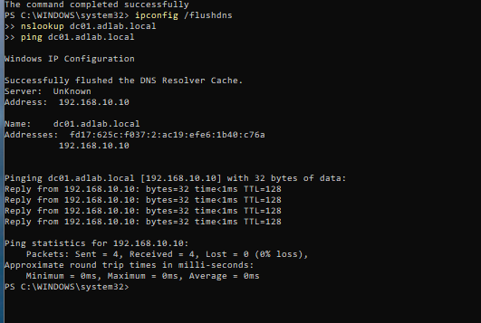
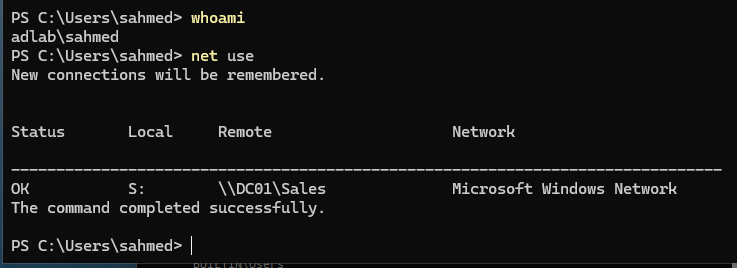
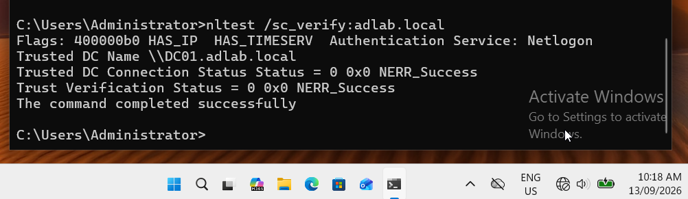

# Enterprise Windows IT Support & Active Directory Lab

Hands-on Windows Server 2022 and Windows 11 home lab designed to simulate common IT Support, Service Desk and Junior Systems Administration tasks in a small enterprise environment.

## Project Highlights

- Built an Active Directory domain: `adlab.local`
- Configured Windows Server 2022 as Domain Controller, DNS and DHCP server
- Joined a Windows 11 workstation (`CLIENT01`) to the domain
- Created organisational units, users and role-based security groups
- Implemented departmental file shares for IT, HR and Sales
- Applied NTFS/share permissions using least-privilege RBAC
- Deployed department drive mappings with Group Policy
- Configured account lockout and workstation security policies
- Enforced Microsoft Defender real-time protection using GPO
- Enabled advanced logon auditing and investigated Event ID 4625
- Used PowerShell for AD user health checks, lockout investigation and account administration
- Troubleshot DNS registration, domain controller discovery and secure-channel issues

## Full Step-by-Step Documentation

For the complete build process, commands, troubleshooting notes and screenshot evidence:

🌐 **[View the Complete Interactive Lab Guide](https://mahadi8566.github.io/enterprise-windows-it-support-lab/)**

Additional references:
- [Complete Markdown Guide](docs/MASTER-LAB-GUIDE.md)
- [Command Cheat Sheet](docs/12-Command-Cheat-Sheet.md)
- [Troubleshooting Log](docs/11-Troubleshooting-Log.md)

## Lab Environment

| Component | Configuration |
|---|---|
| Hypervisor | Oracle VirtualBox |
| Domain Controller | Windows Server 2022 (`DC01`) |
| Client | Windows 11 Pro (`CLIENT01`) |
| Domain | `adlab.local` |
| Internal network | `192.168.10.0/24` |
| DC/DNS/DHCP | `192.168.10.10` |
| Client DHCP lease | `192.168.10.100` |
| Internet access | VirtualBox NAT |

## Active Directory Structure

The environment uses separate organisational units for users, computers and groups, with departmental sub-OUs and role-based security groups.


Examples:

- IT user: `mdmhasan` → `GG_IT_Users`
- Sales user: `sahmed` → `GG_Sales_Users`
- HR user: `mbrown` → `GG_HR_Users`

## DHCP and DNS

`DC01` provides internal DNS and DHCP services for the ADLAB network. `CLIENT01` receives a DHCP lease and uses the domain controller as its DNS server.



During troubleshooting I found that the NAT-facing IP address of the domain controller had registered in AD DNS. I corrected interface DNS-registration settings, removed the stale A record, flushed the client DNS cache and verified that `dc01.adlab.local` resolved cleanly to `192.168.10.10`.



## Group Policy

I created and applied a workstation security baseline to the Windows 11 client OU.

Key controls included:

- Windows Defender Firewall domain profile
- Microsoft Defender real-time protection
- Advanced logon auditing
- Interactive logon security banner
- Account lockout policy
- Department drive mapping using group targeting


## Account Lockout Troubleshooting

The domain account lockout policy was configured to lock accounts after repeated failed authentication attempts.

I intentionally generated failed logons, verified the account lockout state and used PowerShell to investigate and restore access.


## File Shares and RBAC

Departmental shares were created for IT, HR and Sales. Permissions were assigned to AD security groups rather than individual users.

A Sales user successfully received the Sales drive through Group Policy:



The same user could access the Sales share but was denied access to HR and IT resources, demonstrating least-privilege access control.


## Microsoft Defender

Microsoft Defender real-time protection was enforced through Group Policy and verified on the Windows 11 workstation.


## Security Event Investigation

Advanced Audit Policy was configured for successful and failed logons. I generated a controlled failed login and investigated the Windows Security log.

Event Viewer recorded:

- Event ID: `4625`
- Account: `sahmed`
- Domain: `ADLAB`
- Failure reason: unknown username or bad password
- Computer: `CLIENT01.adlab.local`


## PowerShell Helpdesk Toolkit

I consolidated common Active Directory support tasks into a reusable PowerShell script:

[`scripts/Helpdesk-AD-Toolkit.ps1`](scripts/Helpdesk-AD-Toolkit.ps1)

Functions include:

```powershell
Get-ADUserHealth
Unlock-HelpdeskUser
Get-DepartmentMembers
Get-FailedPasswordStatus
```

Example:

```powershell
Get-ADUserHealth -Username mdmhasan
```


## Domain Health Validation

Final validation included:

```powershell
nslookup dc01.adlab.local
ping dc01.adlab.local
nltest /dsgetdc:adlab.local
nltest /sc_verify:adlab.local
gpresult /scope computer /r
```

The client successfully resolved and reached the domain controller, discovered AD services, verified the secure channel and applied the required Group Policy Objects.



## Skills Demonstrated

`Windows Server 2022` · `Windows 11` · `Active Directory Domain Services` · `DNS` · `DHCP` · `Group Policy` · `PowerShell` · `NTFS Permissions` · `SMB File Shares` · `RBAC` · `Microsoft Defender` · `Windows Firewall` · `Event Viewer` · `Authentication Troubleshooting` · `VirtualBox`

## Why I Built This

I built this lab to develop practical skills relevant to IT Support, Service Desk and Desktop Support roles. Rather than documenting only successful configuration, I included realistic troubleshooting scenarios such as DNS-registration issues, account lockouts, failed authentication events, access-denied incidents and domain trust validation.

---

**Author:** Md Mahadi Hasan  
**Target roles:** IT Support · Service Desk · Desktop Support · Junior Systems Administration
