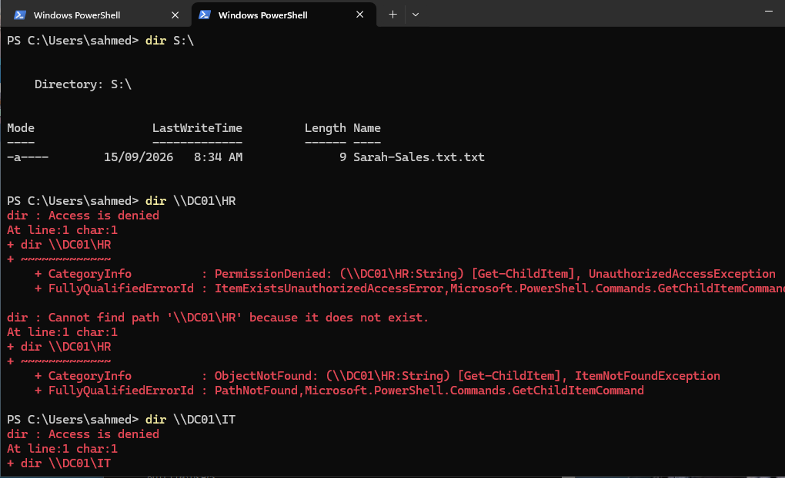
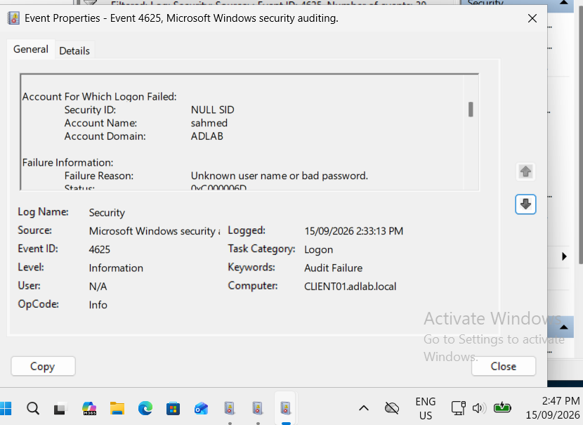
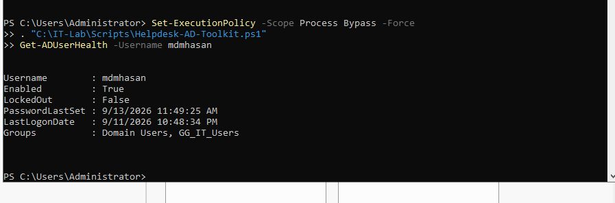
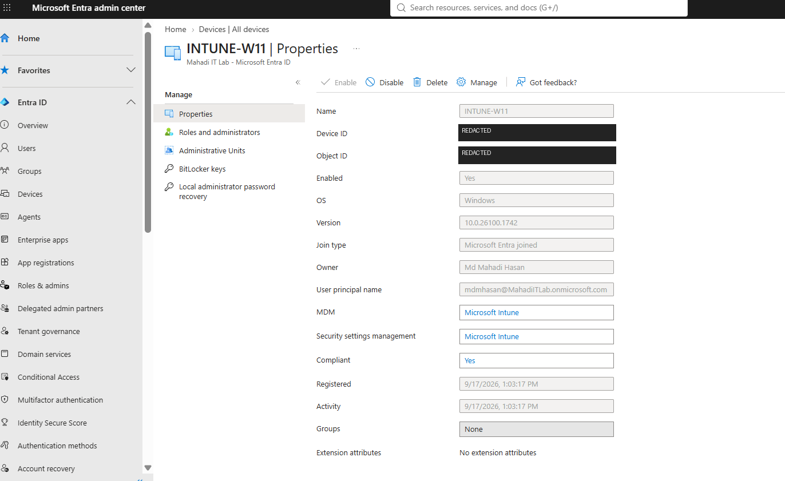

# Enterprise Windows & Microsoft 365 IT Support Lab

Hands-on enterprise IT Support / Service Desk lab covering **Windows Server 2022, Active Directory, Microsoft 365, Microsoft Entra ID, Microsoft Intune, Windows 11, PowerShell, endpoint security, identity administration and troubleshooting**.

The project combines a traditional on-premises Windows environment with a modern Microsoft cloud-managed workplace.

---

## What I Built

### Windows Server & Active Directory

- Built an Active Directory domain: `adlab.local`
- Configured Windows Server 2022 as Domain Controller, DNS and DHCP server
- Joined Windows 11 workstation `CLIENT01` to the domain
- Created users, OUs and departmental security groups
- Implemented NTFS/SMB permissions and least-privilege RBAC
- Deployed Group Policy for drive mapping, account lockout, Defender and Firewall
- Investigated failed logons, Event ID `4625`, DNS registration and secure-channel issues
- Built a reusable PowerShell helpdesk toolkit

### Microsoft 365, Entra ID & Intune

- Built a Microsoft 365 Business Premium lab environment
- Administered Entra ID users, licences and security groups
- Performed password resets, sign-in investigation and session revocation
- Troubleshot Microsoft 365 service-plan access
- Validated Exchange Online two-way mail flow
- Microsoft Entra joined and Intune enrolled `INTUNE-W11`
- Deployed Company Portal through Microsoft Intune
- Created Windows compliance and endpoint security policies
- Verified Microsoft Defender and Windows Firewall configuration
- Audited group-membership changes and restored least privilege
- Tested Conditional Access safely in **Report-only** mode

---

## Documentation

### Windows / Active Directory

🌐 **[Interactive AD Lab Guide](https://mahadi8566.github.io/enterprise-windows-it-support-lab/)**

- [Start Here](docs/00-START-HERE.md)
- [Master Lab Guide](docs/MASTER-LAB-GUIDE.md)
- [Troubleshooting Log](docs/11-Troubleshooting-Log.md)
- [Command Cheat Sheet](docs/12-Command-Cheat-Sheet.md)
- [AD Screenshot Index](docs/AD-Screenshot-Index.md)

### Microsoft 365 / Entra ID / Intune

📘 **[Complete Microsoft 365, Entra ID & Intune Step-by-Step Runbook](docs/13-Microsoft-365-Entra-Intune/README.md)**

The cloud runbook contains the full configuration process, troubleshooting decisions, commands, validation results and screenshot evidence.

---

## Selected Evidence

### Active Directory — Least-Privilege Access Control



### Windows Security — Failed Logon Investigation



### PowerShell Helpdesk Toolkit



### Microsoft Intune — Managed & Compliant Windows 11



### Exchange Online — End-to-End Mail Flow


### Conditional Access — Report-Only Validation


---

## Lab Environment

| Area | Technology |
|---|---|
| Virtualisation | Oracle VirtualBox |
| Server | Windows Server 2022 |
| Endpoints | Windows 11 Pro |
| Identity | Active Directory + Microsoft Entra ID |
| Networking | DNS, DHCP, TCP/IP |
| Cloud | Microsoft 365 Business Premium |
| Endpoint Management | Microsoft Intune |
| Email | Exchange Online |
| Security | Defender, Firewall, Conditional Access |
| Automation | PowerShell |

---

## PowerShell Toolkit

Reusable Active Directory helpdesk script:

[`scripts/Helpdesk-AD-Toolkit.ps1`](scripts/Helpdesk-AD-Toolkit.ps1)

Functions include:

```powershell
Get-ADUserHealth
Unlock-HelpdeskUser
Get-DepartmentMembers
Get-FailedPasswordStatus
```

---

## Skills Demonstrated

`IT Support` · `Service Desk` · `Windows Server 2022` · `Windows 11` · `Active Directory` · `Microsoft 365` · `Microsoft Entra ID` · `Microsoft Intune` · `Exchange Online` · `Conditional Access` · `DNS` · `DHCP` · `Group Policy` · `PowerShell` · `RBAC` · `NTFS Permissions` · `Microsoft Defender` · `Windows Firewall` · `Event Viewer` · `Audit Logs` · `Sign-in Logs` · `Device Compliance` · `Application Deployment` · `Authentication Troubleshooting`

---

## Project Purpose

I built this environment to develop practical skills relevant to **IT Support, Service Desk, Desktop Support and Junior Modern Workplace** roles.

Rather than documenting only successful configurations, the project includes realistic troubleshooting, access-control testing, user administration, endpoint management, security validation and audit evidence.

---

**Author:** Md Mahadi Hasan  
**Target roles:** IT Support · Service Desk · Desktop Support · Junior Systems Administration · Junior Modern Workplace Support
