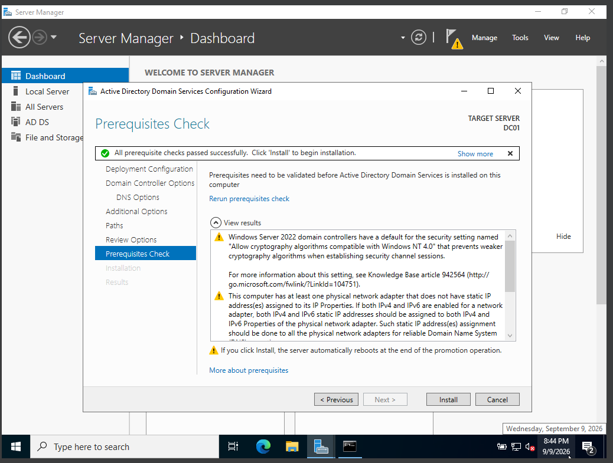
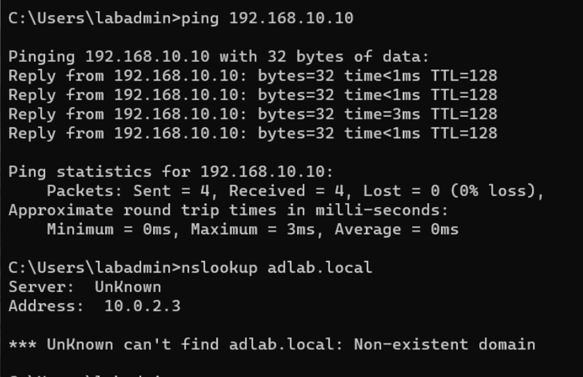
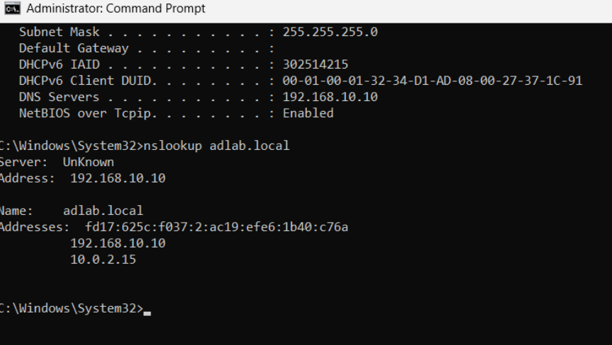
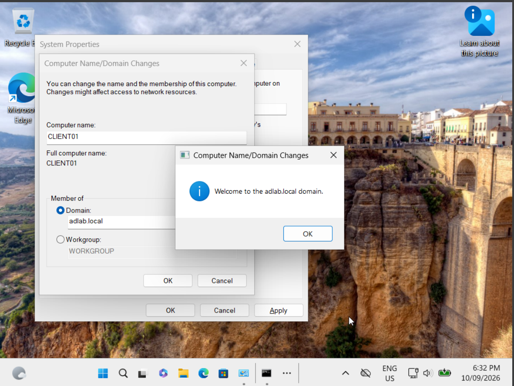

# 2. Active Directory Domain Services and Domain Join

## Step 2.1 — Install Active Directory Domain Services

On DC01:

1. Open **Server Manager → Add roles and features**.
2. Choose **Role-based or feature-based installation**.
3. Select the local server.
4. Select **Active Directory Domain Services** and accept required features.
5. Complete installation.

**Observed result:** AD DS installed successfully and Server Manager offered the promotion action.

**Evidence — Active Directory Domain Services role installed**


## Step 2.2 — Promote DC01 and create a new forest

1. Click the AD DS notification flag in Server Manager.
2. Select **Promote this server to a domain controller**.
3. Choose **Add a new forest**.
4. Root domain name: `adlab.local`.
5. Configure Directory Services Restore Mode password.
6. Continue through DNS/NetBIOS/path pages.
7. Verify prerequisites and install.

**Observed result:** Prerequisite checks passed, the server rebooted, and `DC01` became a writable domain controller for `adlab.local`.

**Evidence — New forest configured as adlab.local**


**Evidence — AD DS prerequisite check passed**




## Step 2.3 — Prepare CLIENT01 for the domain

Before joining the domain, the client needed to resolve the domain controller through AD DNS.

Validation commands used during the lab:

```cmd
ping dc01.adlab.local
nslookup dc01.adlab.local
```

**Observed result:** CLIENT01 could reach the DC and resolve the server name through the ADLAB network.

**Evidence — CLIENT01 reaching DC01 during DNS troubleshooting**




**Evidence — CLIENT01 resolving DC01 through DNS**




## Step 2.4 — Join CLIENT01 to adlab.local

1. On CLIENT01 open system/domain settings.
2. Change membership from workgroup to **Domain**.
3. Enter: `adlab.local`.
4. Provide domain administrator credentials.
5. Accept the welcome message and restart.

**Observed result:** CLIENT01 became a member computer of `adlab.local` and could authenticate domain users.

**Evidence — CLIENT01 domain join success**



