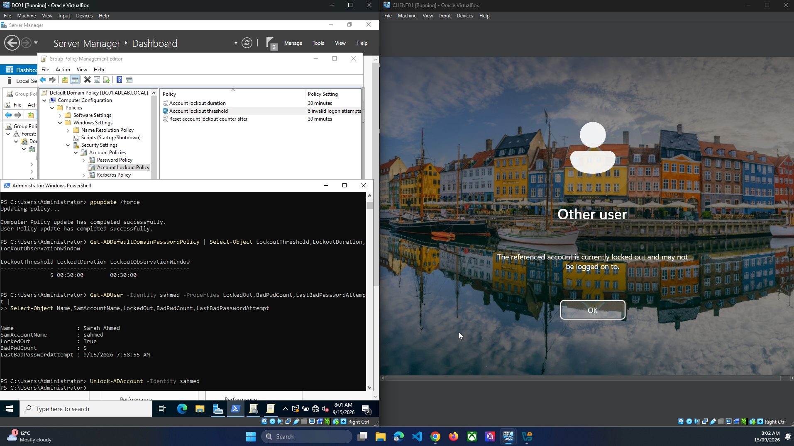
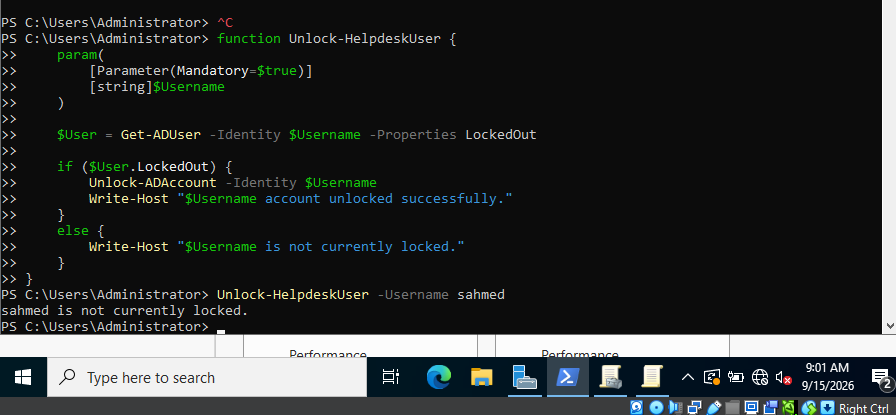

# 7. Account Lockout and Helpdesk Troubleshooting

## Step 7.1 — Generate a controlled account lockout

Using Sales user `sahmed`, intentionally submit an incorrect password five times to trigger the configured domain lockout policy.

## Step 7.2 — Diagnose the lockout in PowerShell

On DC01, inspect account state:

```powershell
Get-ADUser -Identity sahmed -Properties LockedOut,BadPwdCount,LastBadPasswordAttempt |
    Select-Object SamAccountName,LockedOut,BadPwdCount,LastBadPasswordAttempt
```

**Observed result:** The lab captured:

- `LockedOut = True`
- `BadPwdCount = 5`


**Evidence — Locked account detected after failed password attempts**




## Step 7.3 — Unlock the account

Command used:

```powershell
Unlock-ADAccount -Identity sahmed
```

Verify again:

```powershell
Get-ADUser -Identity sahmed -Properties LockedOut,BadPwdCount |
    Select-Object SamAccountName,LockedOut,BadPwdCount
```

**Observed result:** `LockedOut` changed to `False`, and Sarah could sign in successfully afterward.

**Evidence — PowerShell account-unlock workflow**




## Step 7.4 — Helpdesk lesson documented

This scenario demonstrated a common Service Desk workflow:

1. Confirm identity/account.
2. Check lockout status and bad-password count.
3. Unlock only when appropriate.
4. Confirm successful sign-in.
5. If repeated lockout occurs, investigate saved credentials, mapped drives, scheduled tasks or another source of bad-password attempts.
