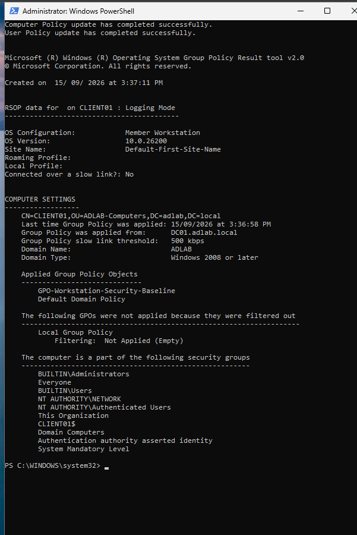

# 10. Final Health and End-to-End Validation

## Step 10.1 — Validate DNS and connectivity

On CLIENT01:

```cmd
ipconfig /flushdns
nslookup dc01.adlab.local
ping dc01.adlab.local
```

**Observed result:** `dc01.adlab.local` resolved to `192.168.10.10`, and ping completed successfully.

**Evidence — Final DNS and connectivity validation**


## Step 10.2 — Validate domain-controller discovery

```cmd
nltest /dsgetdc:adlab.local
```

Expected/observed target: `\DC01.adlab.local` on `192.168.10.10` with the appropriate AD service flags.

## Step 10.3 — Validate the secure channel

Run from an elevated command prompt:

```cmd
nltest /sc_verify:adlab.local
```

**Observed result:** The secure-channel verification returned `NERR_Success`.

**Evidence — Domain secure-channel verification**


**Evidence — Final secure-channel proof**


## Step 10.4 — Validate applied Group Policy

```cmd
gpupdate /force
gpresult /scope computer /r
```

**Observed result:**

- `GPO-Workstation-Security-Baseline` applied.
- `Default Domain Policy` applied.
- Policy source was `DC01.adlab.local`.
- CLIENT01 appeared under the `ADLAB-Computers` OU.

**Evidence — Final GPO validation**




## Step 10.5 — Final project acceptance criteria

The lab was considered complete after confirming all of the following:

- CLIENT01 had a valid DHCP lease on the ADLAB network.
- AD DNS resolved DC01 correctly without the stale NAT IPv4 record.
- The domain controller could be discovered.
- The domain secure channel was healthy.
- Required computer GPOs applied.
- Sales drive mapping worked for the Sales user.
- Sales user access to HR and IT was denied.
- Defender antivirus and real-time protection were enabled.
- Logon auditing was active and Event ID 4625 could be investigated.
- The PowerShell helpdesk toolkit executed successfully against Active Directory.
