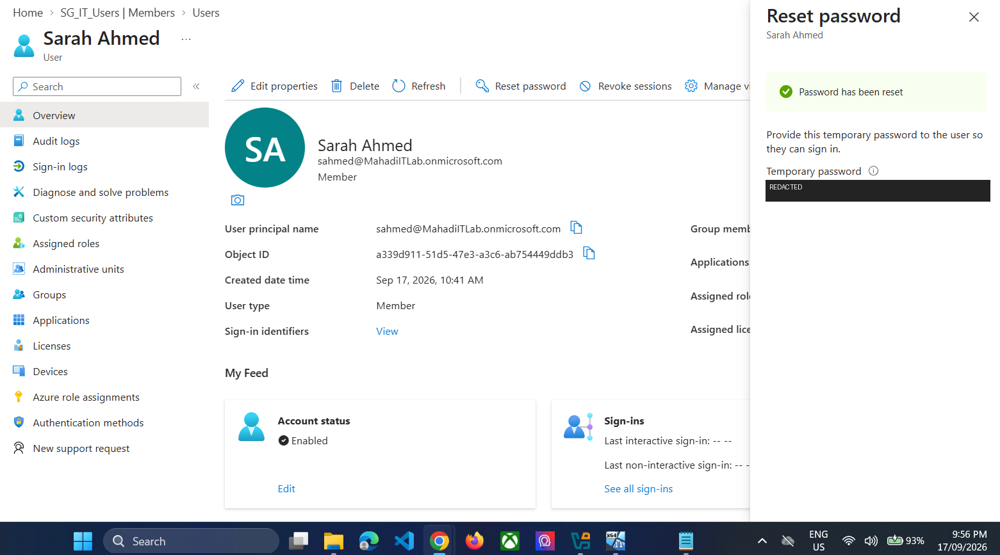
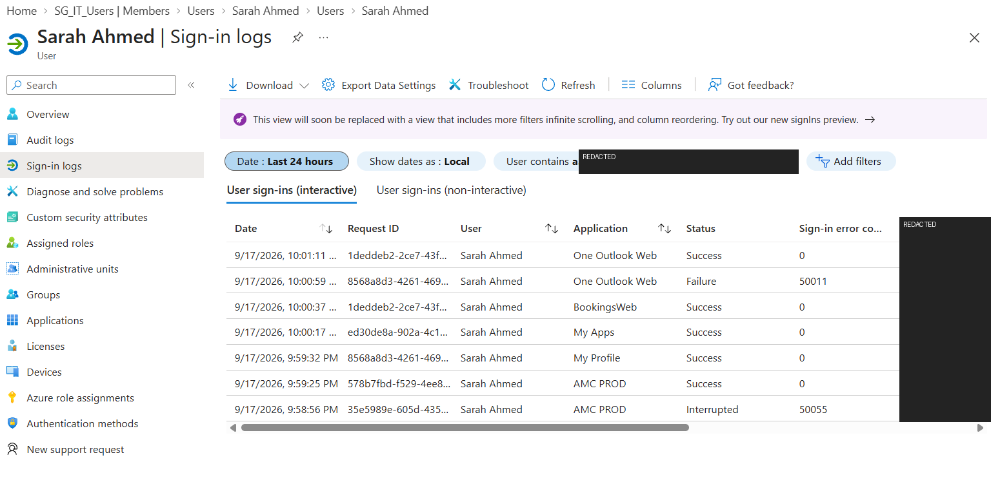

# INC-005 — Microsoft 365 Password Reset & Sign-in Validation

**Status:** Resolved  
**Category:** Microsoft 365 / Identity  
**Priority:** P3 — Medium  
**Environment:** Microsoft 365 / Microsoft Entra ID

> Simulated Service Desk ticket reconstructed from troubleshooting completed in this personal lab.

## User report
A Microsoft 365 test user required a password reset and confirmation that access had been restored.

## Investigation
The account was reviewed in Microsoft 365 / Entra administration.

## Resolution
The password was reset and the simulated user completed a fresh sign-in. Public evidence uses a redacted reset screenshot.

## Validation
Successful sign-in was confirmed and Entra sign-in logs were reviewed after remediation.

## Evidence

