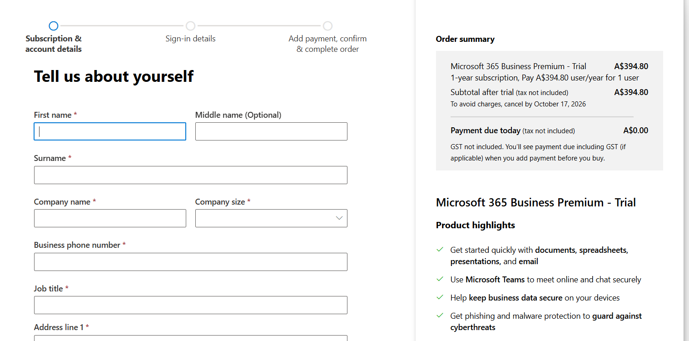
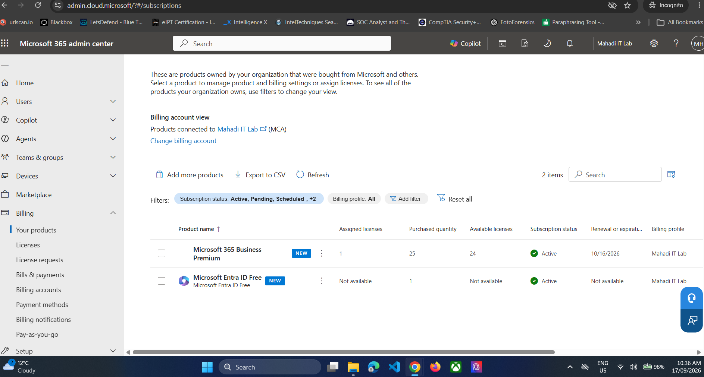
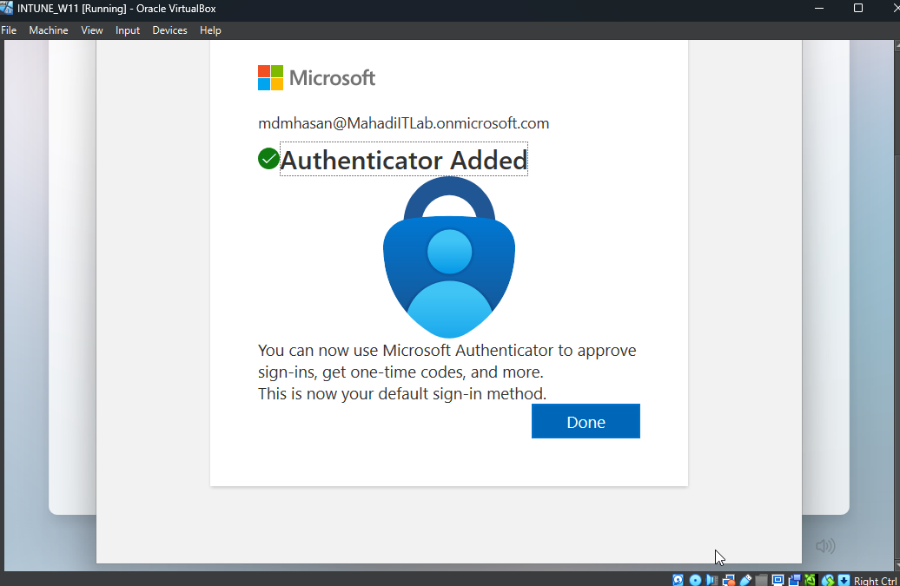
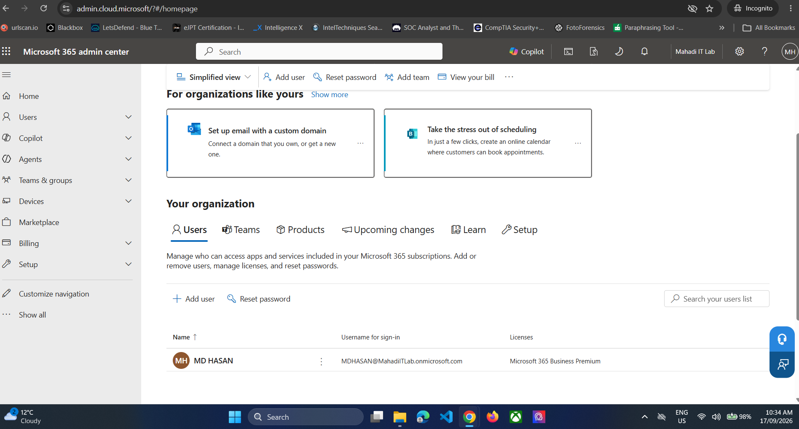

# 01 — Microsoft 365 Tenant, Business Premium and MFA

## Objective
Create a Microsoft 365 Business Premium lab tenant with sufficient licences for multiple test users, then secure the administrator account with Microsoft Authenticator.

## Step 1 — Select Microsoft 365 Business Premium trial
Use the Microsoft 365 Business Premium trial rather than Business Standard because this lab requires Microsoft Intune and Entra security capabilities.

*Evidence: Microsoft 365 Business Premium trial selected.*

## Step 2 — Create the organisation
Organisation used in the lab:

- Organisation name: `Mahadi IT Lab`
- Tenant domain: `MahadiITLab.onmicrosoft.com`
- Admin account: separate administrator identity
- Region: Australia

Do not use an employer's company name for a personal lab tenant.

## Step 3 — Verify the subscription
The Business Premium trial provided 25 seats, allowing the lab to simulate multiple users.

*Evidence: Business Premium subscription and available licences.*

## Step 4 — Configure Microsoft Authenticator for the admin
Open **Security info**, add **Microsoft Authenticator**, scan the QR code and approve the test notification.

*Evidence: Authenticator registration completed.*

## Step 5 — Verify Microsoft 365 Admin Center access
Open `admin.microsoft.com` and confirm the correct tenant and subscription.

*Evidence: Mahadi IT Lab Microsoft 365 admin environment.*

## Result
The tenant, administrator authentication and Microsoft 365 Business Premium licensing were ready for the lab.
