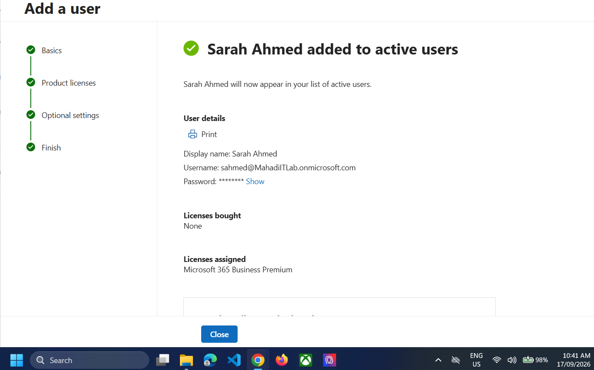
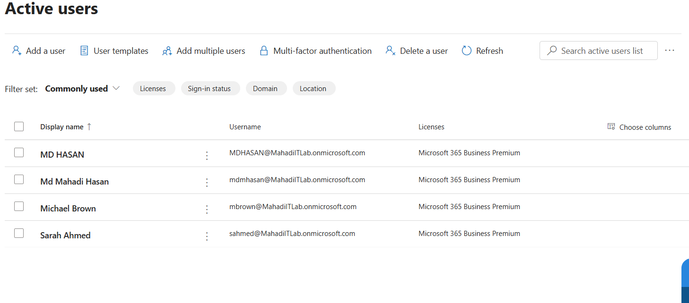
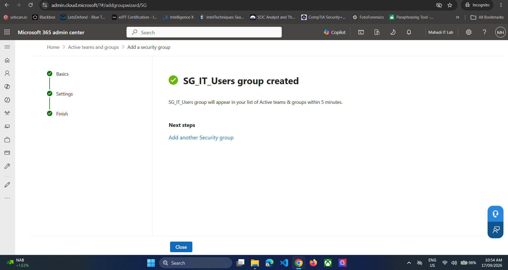
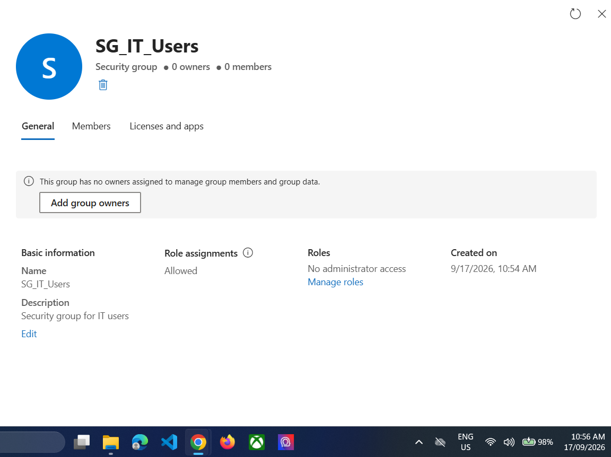

# 02 — Users, Licensing and Security Groups

## Objective
Create departmental cloud users, assign Microsoft 365 Business Premium, and build security groups that mirror the on-premises IT/HR/Sales structure.

## Step 1 — Create cloud users
Test users:
- `mdmhasan@MahadiITLab.onmicrosoft.com` — IT
- `mbrown@MahadiITLab.onmicrosoft.com` — HR
- `sahmed@MahadiITLab.onmicrosoft.com` — Sales

Example user creation:

*Evidence: Sarah Ahmed cloud user created.*

## Step 2 — Assign Business Premium licences
For each test user:
1. Open **Users → Active users**.
2. Open the user.
3. Assign **Microsoft 365 Business Premium**.
4. Set usage location to Australia.
5. Save.

*Evidence: Cloud users with Microsoft 365 Business Premium assigned.*

## Step 3 — Create departmental security groups
Created:
- `SG_IT_Users`
- `SG_HR_Users`
- `SG_Sales_Users`

Use **Security** group type with **Assigned** membership.

*Evidence: Security group creation.*

## Step 4 — Add correct departmental members
- Md Mahadi Hasan → `SG_IT_Users`
- Michael Brown → `SG_HR_Users`
- Sarah Ahmed → `SG_Sales_Users`

*Evidence: Departmental security group membership.*

## Result
The Microsoft 365 tenant had a realistic user/group structure ready for Intune assignments and helpdesk scenarios.
