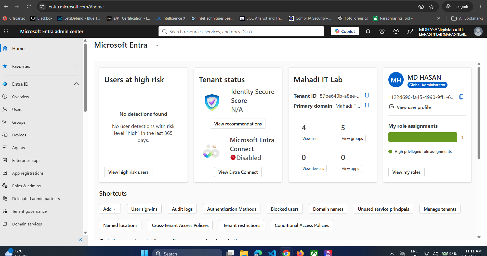
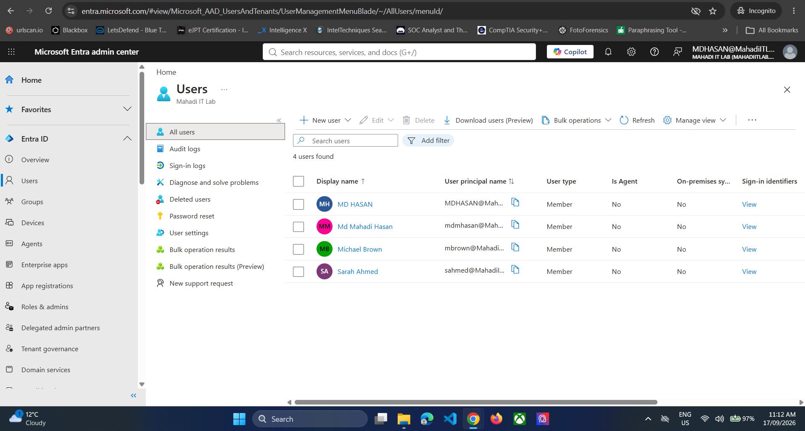
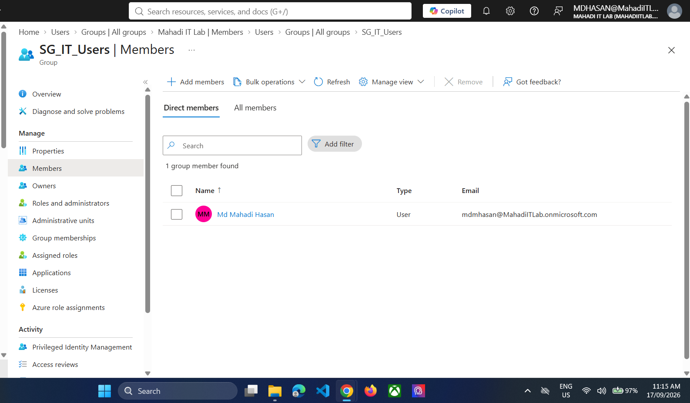

# 03 — Microsoft Entra ID Verification

## Objective
Confirm that Microsoft 365 identities and groups are visible and manageable through Microsoft Entra ID.

## Step 1 — Open Microsoft Entra admin center
Open `entra.microsoft.com` with the administrator account.

*Evidence: Microsoft Entra admin center.*

## Step 2 — Verify cloud users
Go to **Entra ID → Users → All users** and verify the administrator plus the three standard users.

*Evidence: Entra ID all users.*

## Step 3 — Verify security-group membership
Open `SG_IT_Users → Members` and validate the IT user.

*Evidence: SG_IT_Users membership in Microsoft Entra ID.*

## Result
The identities and groups were confirmed at the Entra identity layer.
