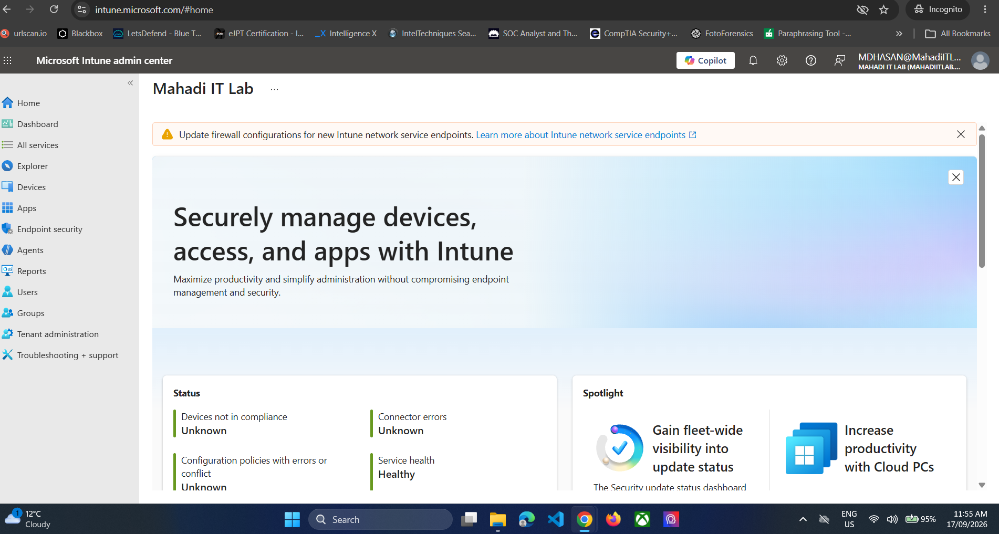
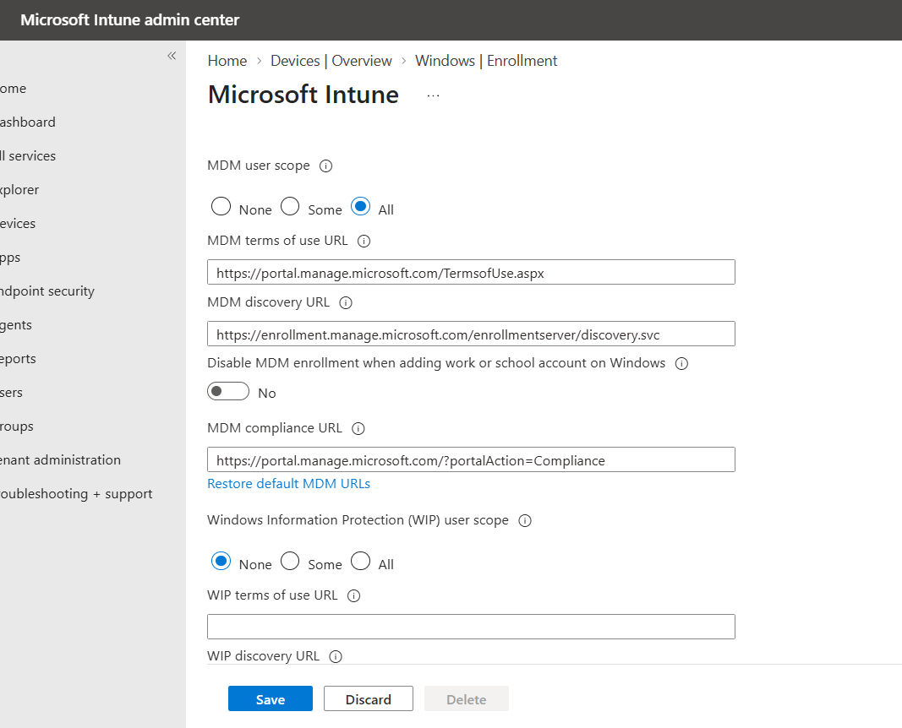
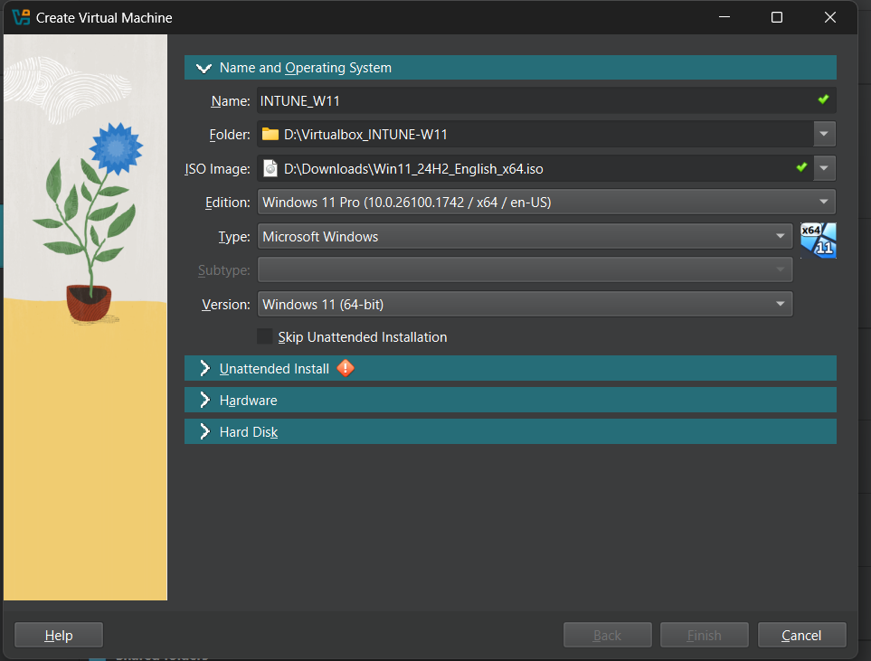
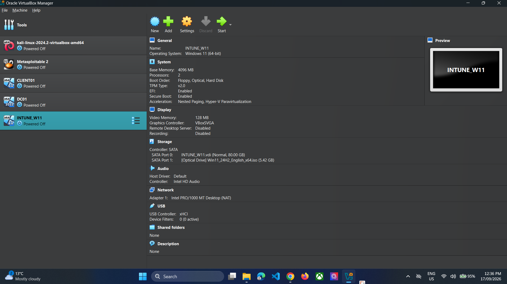
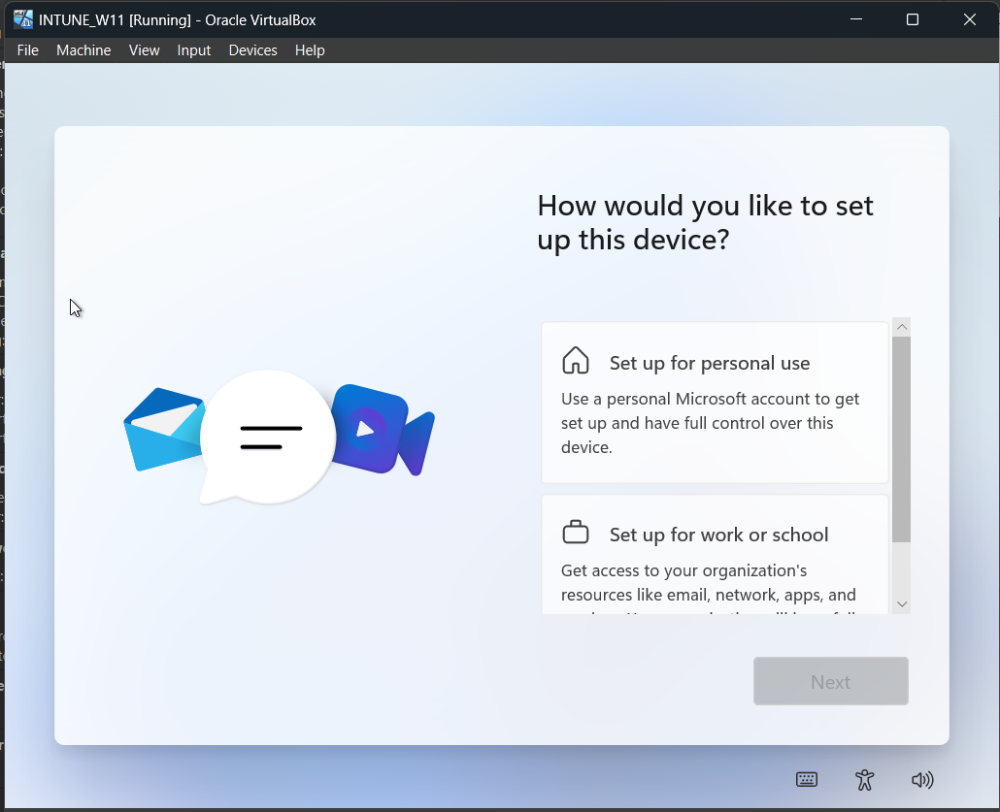
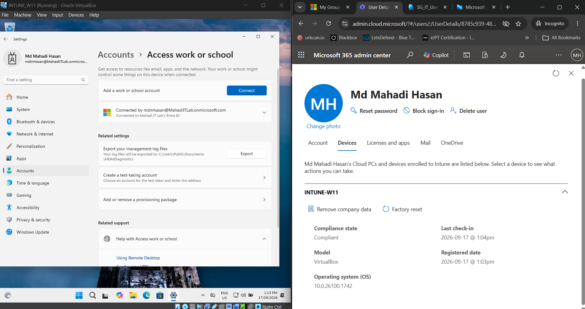
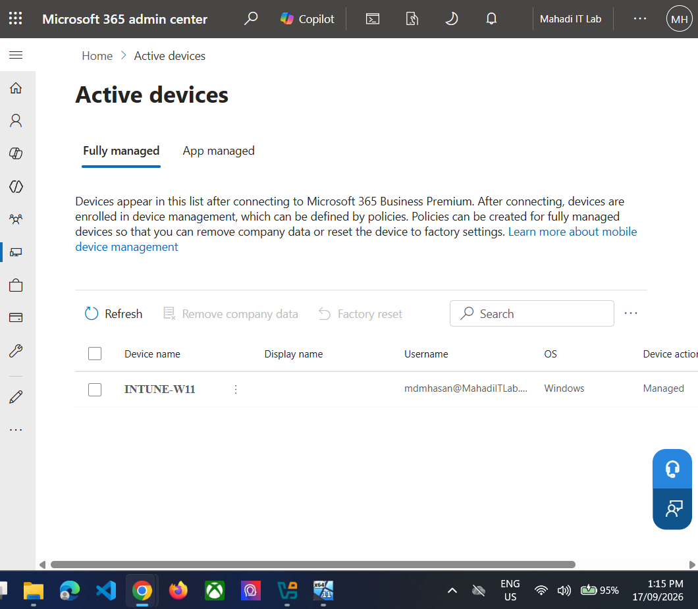

# 04 — Intune Enrollment and Windows 11 Cloud Device

## Objective
Create a separate cloud-managed Windows 11 VM, join it to Microsoft Entra ID and automatically enroll it into Microsoft Intune.

## Design choice
The existing `CLIENT01` remains an on-premises AD domain client. A separate VM, `INTUNE-W11`, is used for the modern cloud-managed scenario.

## Step 1 — Confirm Intune access
Open `intune.microsoft.com`.

*Evidence: Microsoft Intune admin center.*

## Step 2 — Configure automatic MDM enrollment
Go to **Devices → Windows → Windows enrollment → Automatic Enrollment**.

Lab setting:
- MDM user scope: `All`
- WIP user scope: `None`

*Evidence: Automatic MDM enrollment configured.*

## Step 3 — Create a Windows 11 Pro VM
VirtualBox:
- Name: `INTUNE-W11`
- Windows 11 Pro
- 4 GB RAM
- 2 vCPU
- 64–80 GB disk
- NAT network
- Existing Windows 11 ISO reused

*Evidence: INTUNE-W11 Windows 11 Pro VM.*

*Evidence: INTUNE-W11 VirtualBox hardware.*

## Step 4 — Install Windows 11 and choose work/school setup
During Windows OOBE, select **Set up for work or school** rather than personal use.

*Evidence: Windows 11 work or school setup.*

Use the standard cloud user:
`mdmhasan@MahadiITLab.onmicrosoft.com`

Do not use the Global Administrator account as the daily user.

## Step 5 — Verify work-account connection
On Windows:
**Settings → Accounts → Access work or school**

*Evidence: Windows work account connected to Mahadi IT Lab.*

## Step 6 — Verify cloud-side device management
The device appeared as managed in Microsoft 365 and as Entra joined / Intune managed.

*Evidence: INTUNE-W11 shown as a managed device.*

*Evidence: INTUNE-W11 Entra joined, Intune managed and compliant.*

## Result
`INTUNE-W11` became the cloud-managed endpoint used for compliance, configuration, app deployment and Conditional Access testing.
