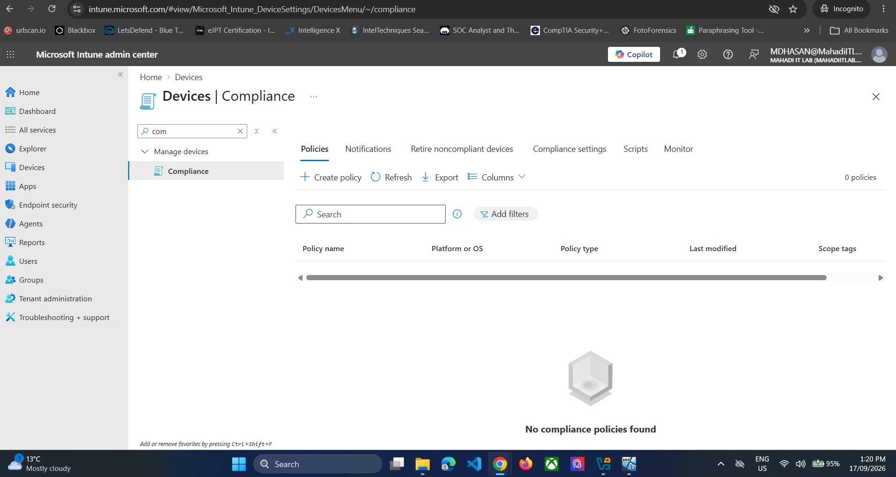
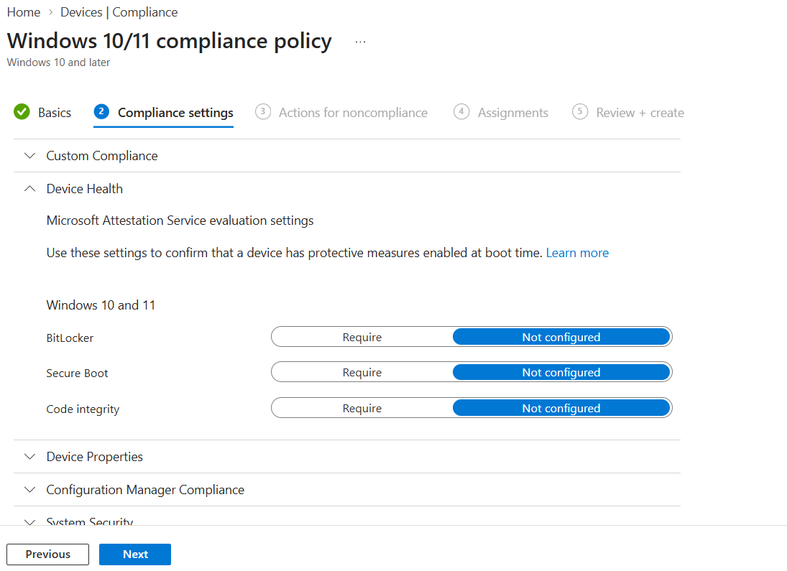
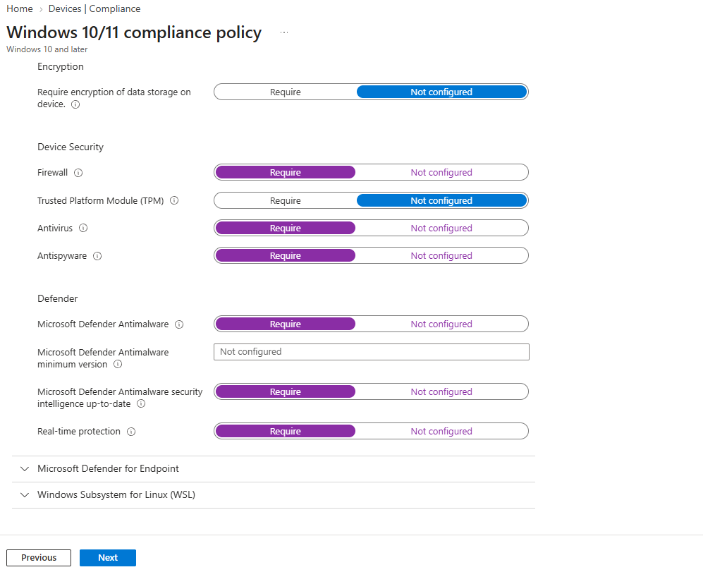
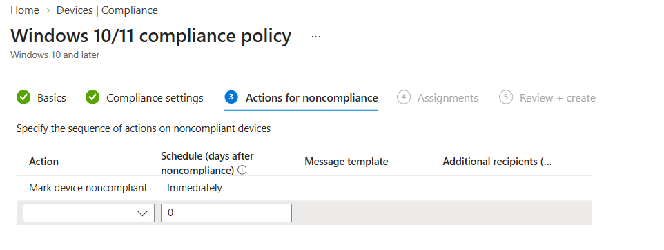
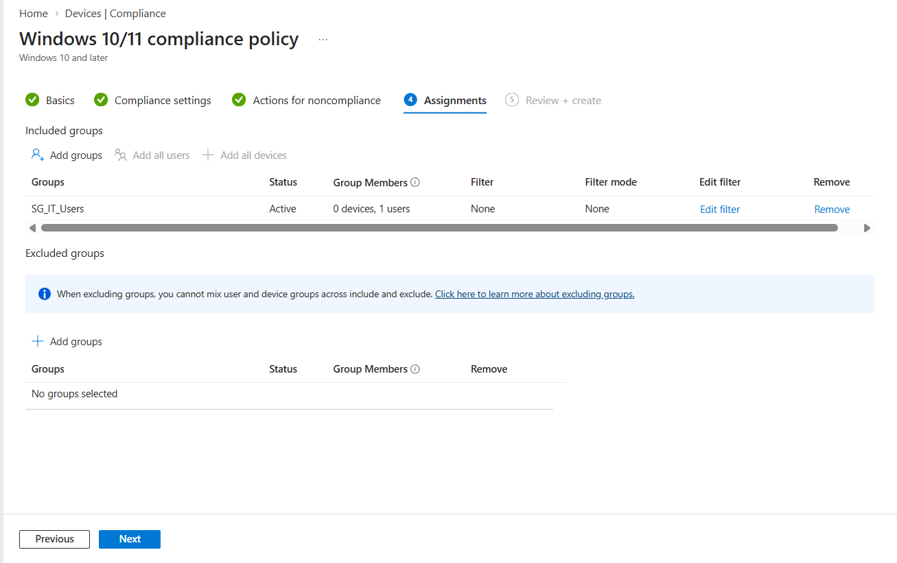
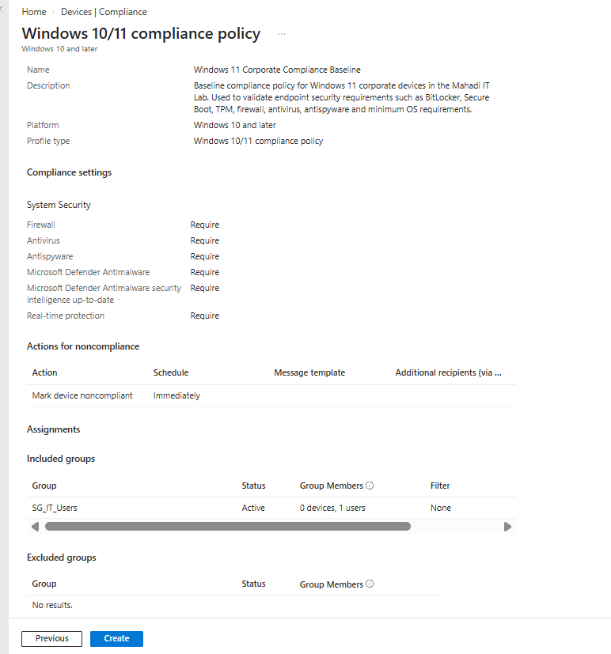
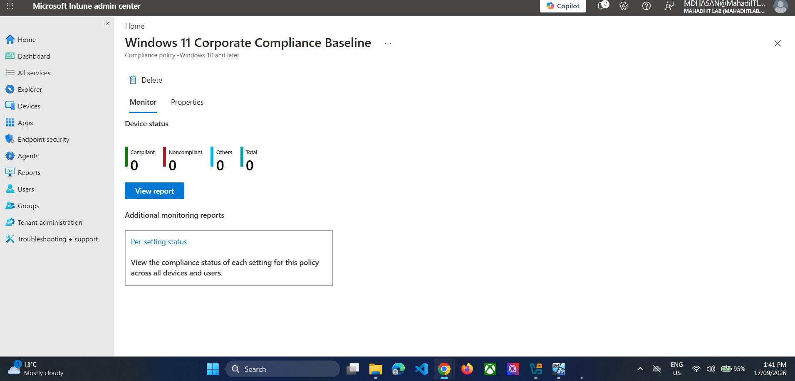
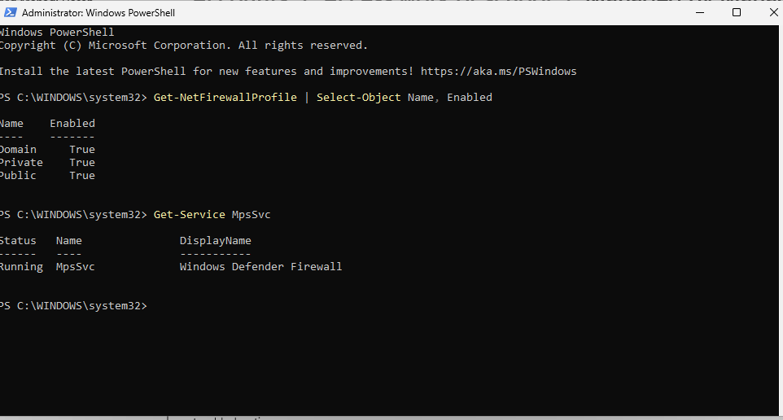
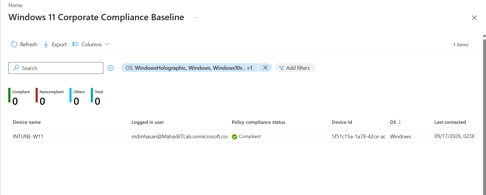
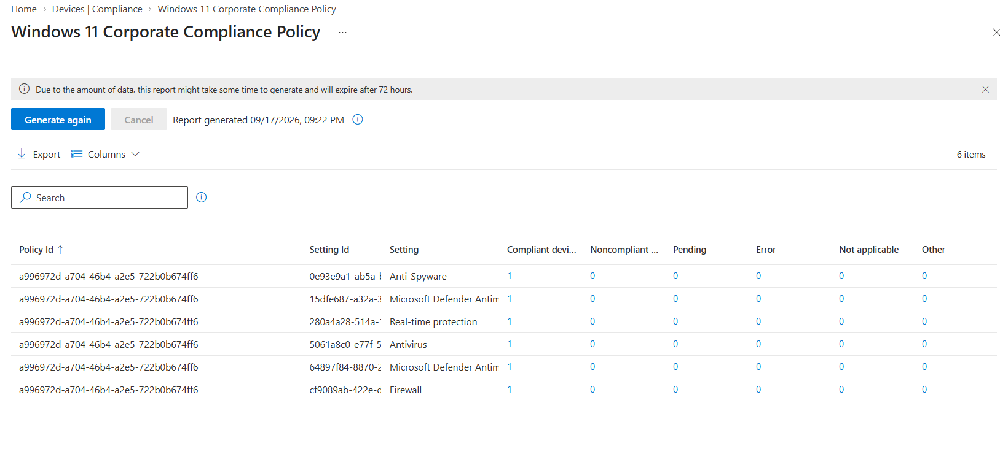

# 05 — Intune Compliance Policy

## Objective
Define security compliance requirements and verify that `INTUNE-W11` satisfies them.

## Step 1 — Create a Windows compliance policy
Go to **Devices → Compliance → Policies → Create policy**.

Platform:
`Windows 10 and later`



*Evidence: Windows compliance policy creation.*


## Step 2 — Device Health
For the first reliable VM baseline, leave BitLocker/Secure Boot/Code Integrity not configured unless they are intentionally being tested.



*Evidence: Device Health compliance configuration.*


## Step 3 — System Security requirements
Required:
- Firewall
- Antivirus
- Antispyware
- Microsoft Defender Antimalware
- Security intelligence up to date
- Real-time protection

TPM / storage encryption were left not configured for this VirtualBox lab.



*Evidence: System Security compliance requirements.*


## Step 4 — Noncompliance action
Keep:
`Mark device noncompliant → Immediately`



*Evidence: Immediate noncompliance action.*


## Step 5 — Assign to SG_IT_Users
Use targeted group assignment instead of All Users / All Devices.



*Evidence: Compliance policy assigned to SG_IT_Users.*


## Step 6 — Review and create



*Evidence: Compliance policy review.*




*Evidence: Compliance policy created.*


## Step 7 — Sync the device
Windows:
**Settings → Accounts → Access work or school → Info → Sync**

## Step 8 — Troubleshoot the firewall evaluation
When Intune initially reported a Firewall evaluation problem, verify the endpoint before changing policy.

PowerShell:
```powershell
Get-NetFirewallProfile | Select-Object Name, Enabled
Get-Service MpsSvc
```




*Evidence: Endpoint firewall profiles and Windows Defender Firewall service verified.*


The endpoint firewall was enabled, so no unnecessary policy change was made. After sync/re-evaluation, the compliance result updated successfully.

## Step 9 — Verify compliant status



*Evidence: INTUNE-W11 reported compliant.*


## Step 10 — Generate per-setting report



*Evidence: All configured compliance checks reported compliant.*


## Result
The device was centrally evaluated and reported compliant for the required Defender and Firewall controls.
