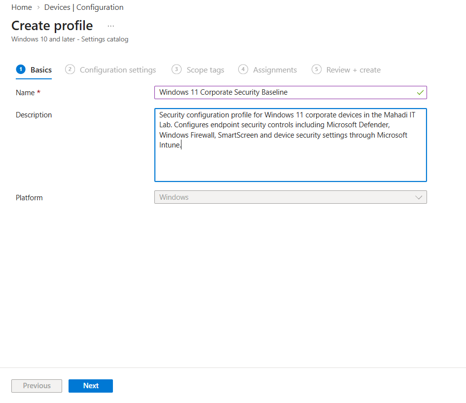
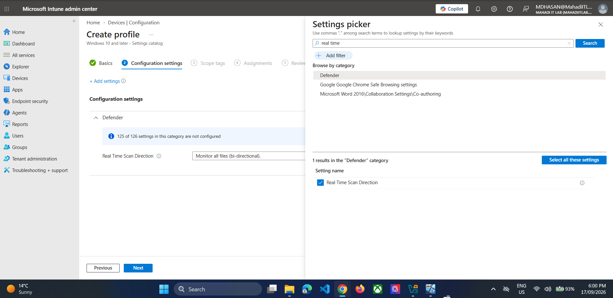
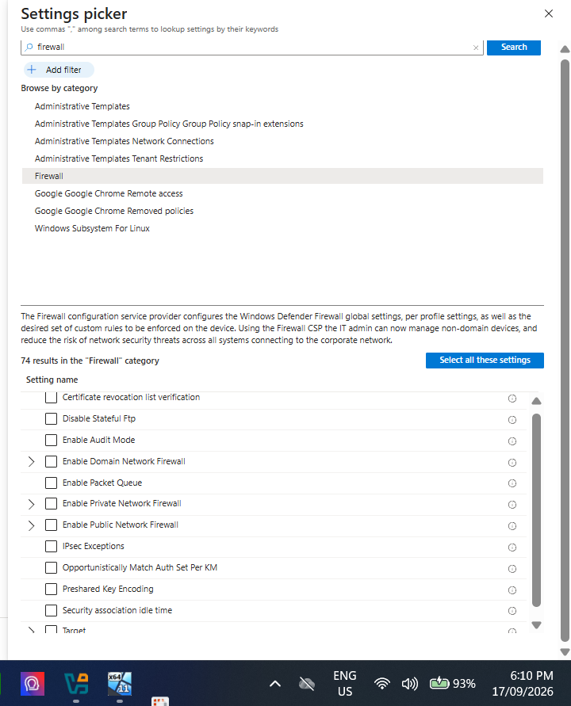
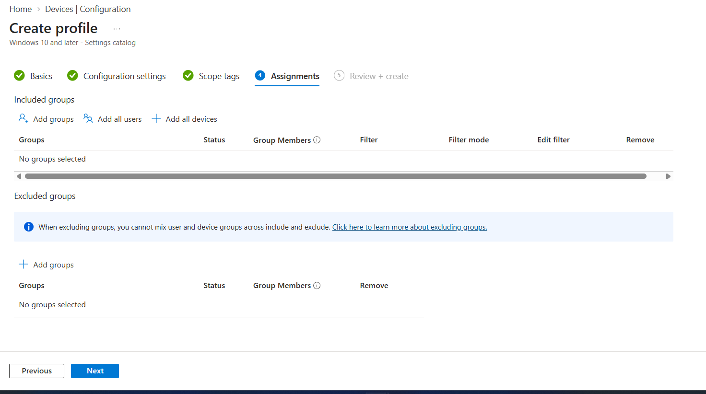
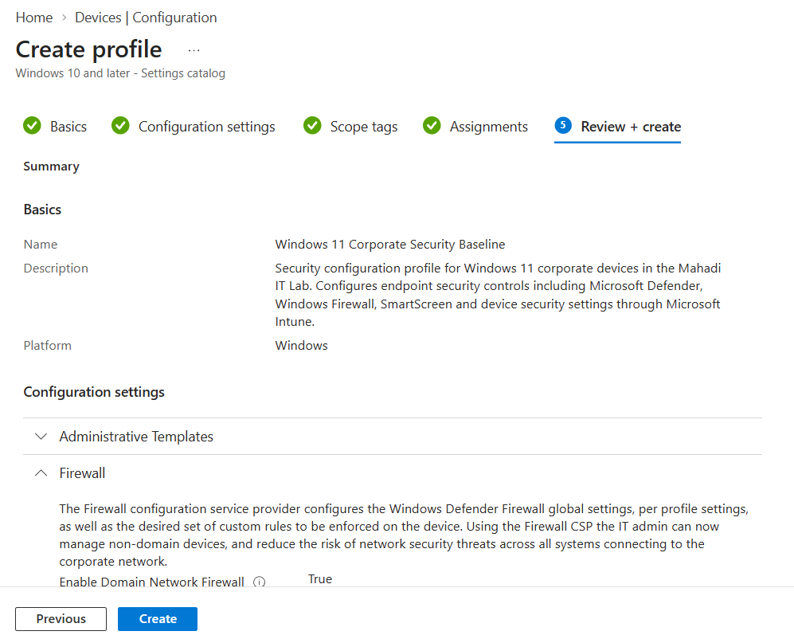
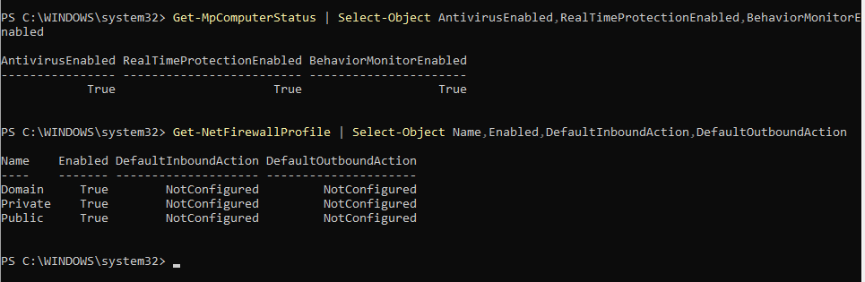
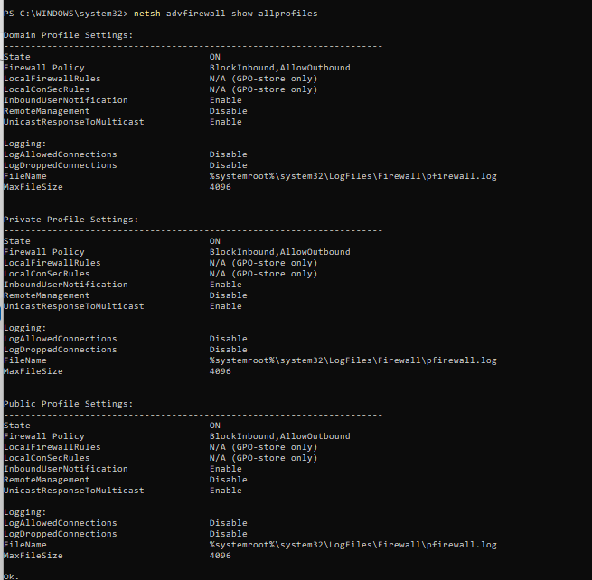
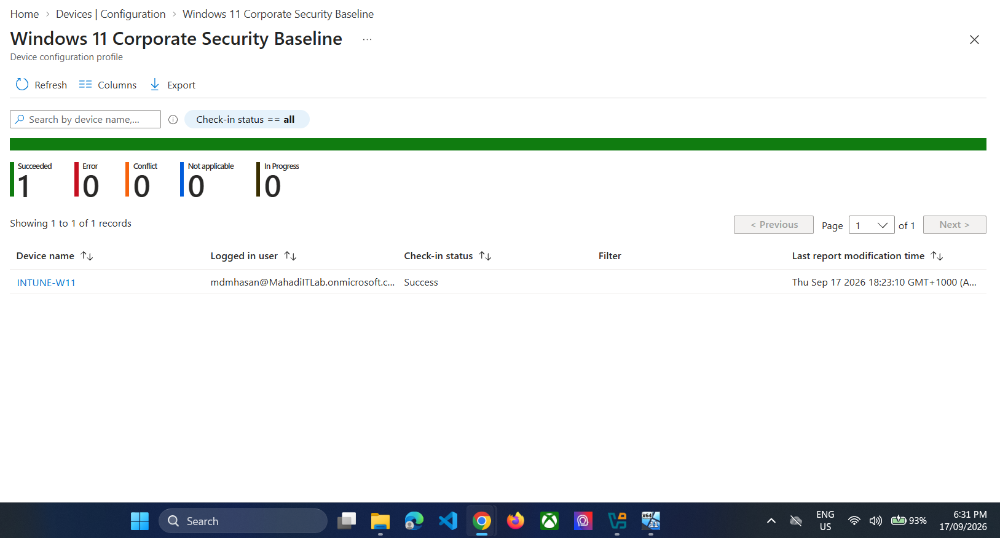
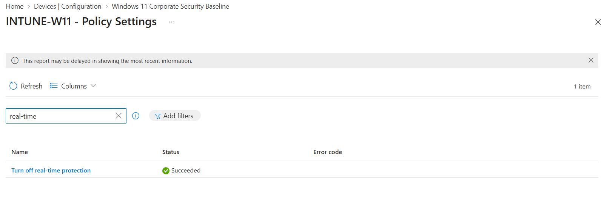

# 06 — Intune Settings Catalog Security Baseline

## Objective
Use Intune to actively configure Windows security settings, then validate them both from Intune and locally on the endpoint.

## Step 1 — Create Settings Catalog profile
Name:
`Windows 11 Corporate Security Baseline`



*Evidence: Windows 11 Corporate Security Baseline basics.*


## Step 2 — Configure Microsoft Defender
Selected Administrative Templates → Microsoft Defender Antivirus → Real-time Protection.

Settings:
- Turn on behavior monitoring → Enabled
- Turn off real-time protection → Disabled
- Scan all downloaded files and attachments → Enabled
- Monitor file and program activity → Enabled




*Evidence: Defender real-time protection settings.*


## Step 3 — Configure Windows Firewall
Enable:
- Domain Network Firewall
- Private Network Firewall
- Public Network Firewall




*Evidence: Firewall settings selected in Settings Catalog.*


## Step 4 — Assign to SG_IT_Users



*Evidence: Security baseline assigned to SG_IT_Users.*


## Step 5 — Review and create



*Evidence: Security baseline review.*


## Step 6 — Force device sync
Windows:
**Settings → Accounts → Access work or school → Info → Sync**

## Step 7 — Verify Defender locally
Run PowerShell as Administrator:
```powershell
Get-MpComputerStatus |
Select-Object AntivirusEnabled,RealTimeProtectionEnabled,BehaviorMonitorEnabled
```




*Evidence: Defender endpoint verification.*


## Step 8 — Verify effective Firewall configuration
```cmd
netsh advfirewall show allprofiles
```

Expected effective state:
- Domain / Private / Public → ON
- Inbound → Block
- Outbound → Allow




*Evidence: Effective Windows Firewall configuration.*


## Step 9 — Verify Intune deployment status



*Evidence: Intune policy deployment succeeded.*




*Evidence: Real-time protection policy setting succeeded.*


## Result
The lab proved both administrator-side deployment and endpoint-side security enforcement.
