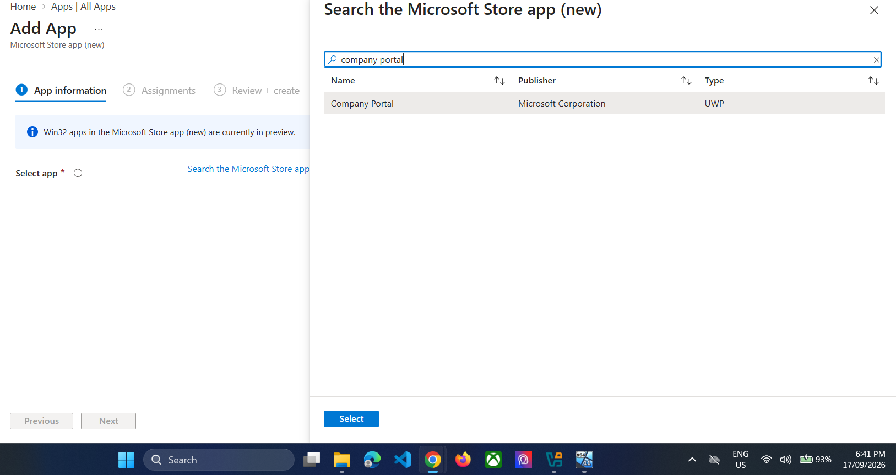
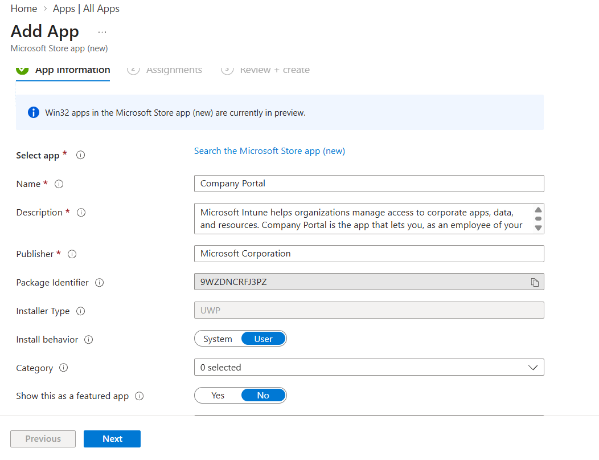
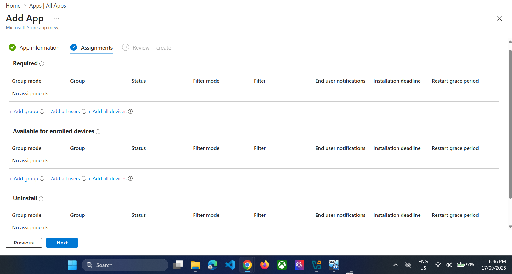
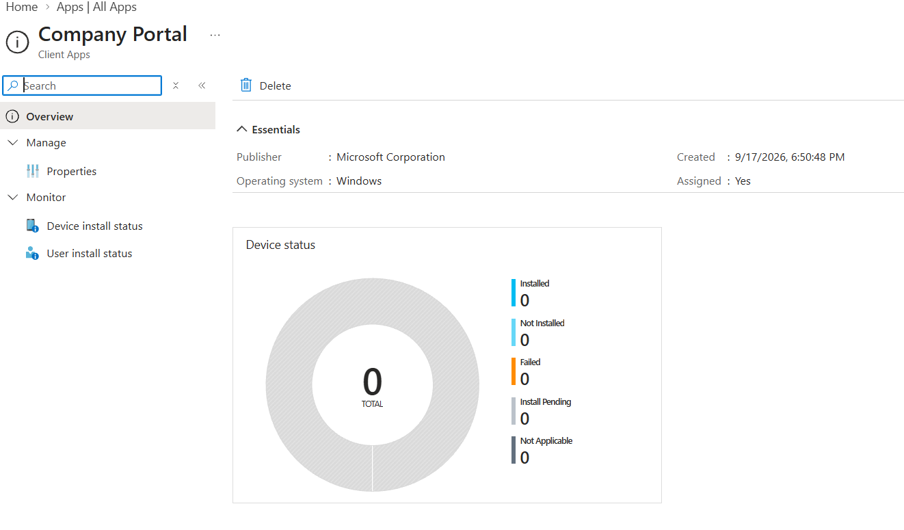
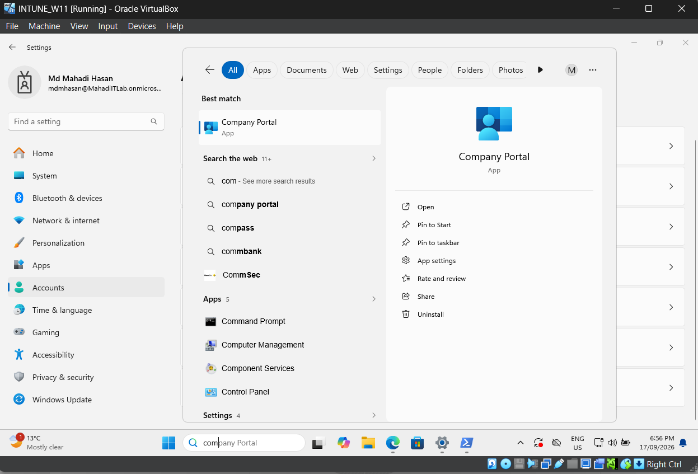
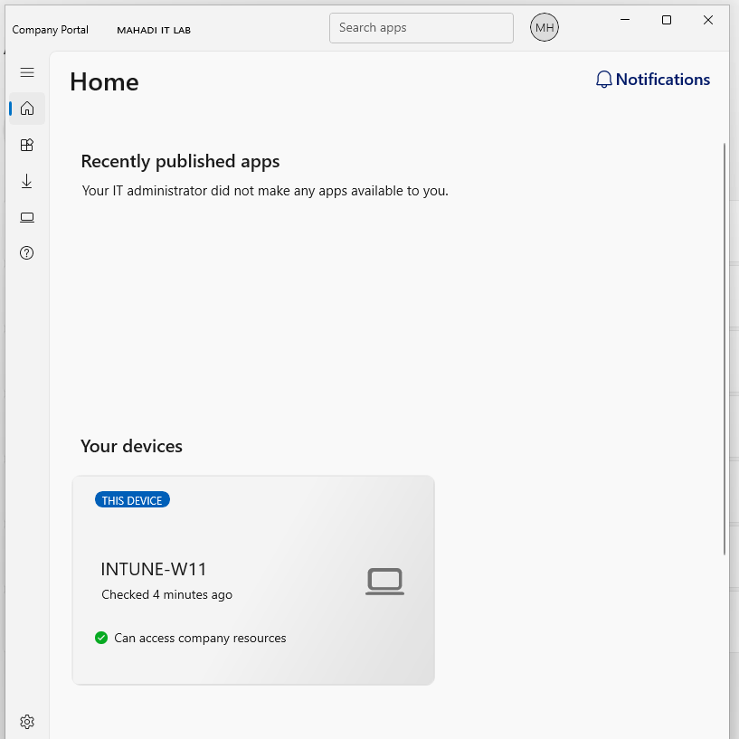
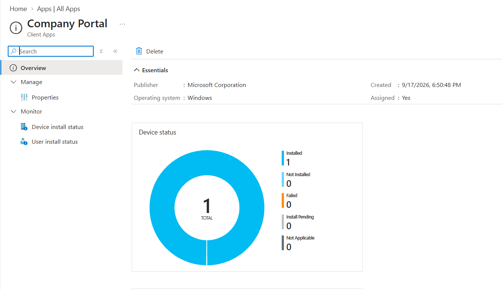

# 07 — Intune App Deployment: Company Portal

## Objective
Deploy a Microsoft Store app through Intune to the managed Windows device and verify the installation.

## Step 1 — Add Microsoft Store app
Go to **Apps → All apps → Create → Microsoft Store app (new)**.
Search for **Company Portal**.

*Evidence: Company Portal selected from Microsoft Store.*

## Step 2 — Review app information
Keep the Microsoft publisher information and User install behavior.

*Evidence: Company Portal app information.*

## Step 3 — Assign as Required
Assign to:
`SG_IT_Users`

Use **Required** so the app is automatically deployed.

*Evidence: Company Portal required assignment.*

## Step 4 — Create the app deployment

*Evidence: Company Portal Intune app created.*

## Step 5 — Sync the endpoint and verify installation
On `INTUNE-W11`, sync the work account and search the Start menu for Company Portal.

*Evidence: Company Portal installed on INTUNE-W11.*

## Step 6 — Validate the managed device in Company Portal

*Evidence: Company Portal device access status.*

## Step 7 — Verify Intune install status

*Evidence: Intune reports Company Portal installed.*

## Result
A required Microsoft Store application was deployed end-to-end from Intune and verified on the endpoint.
