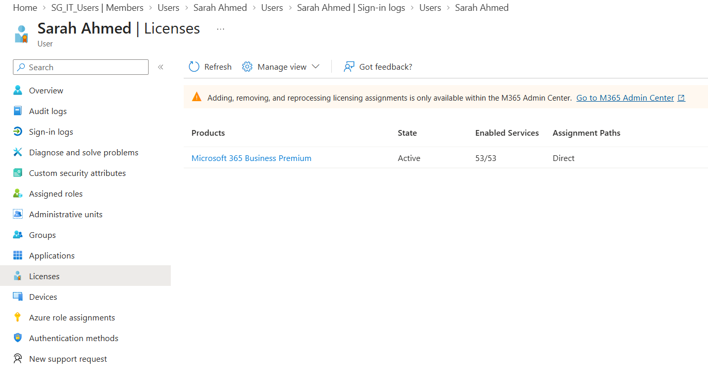
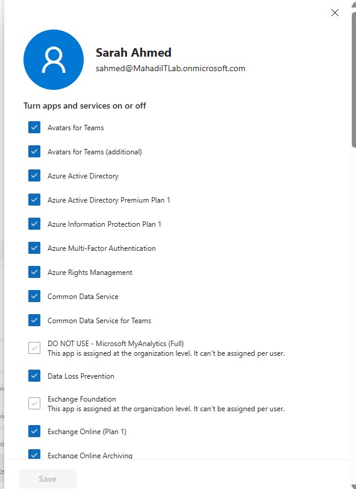
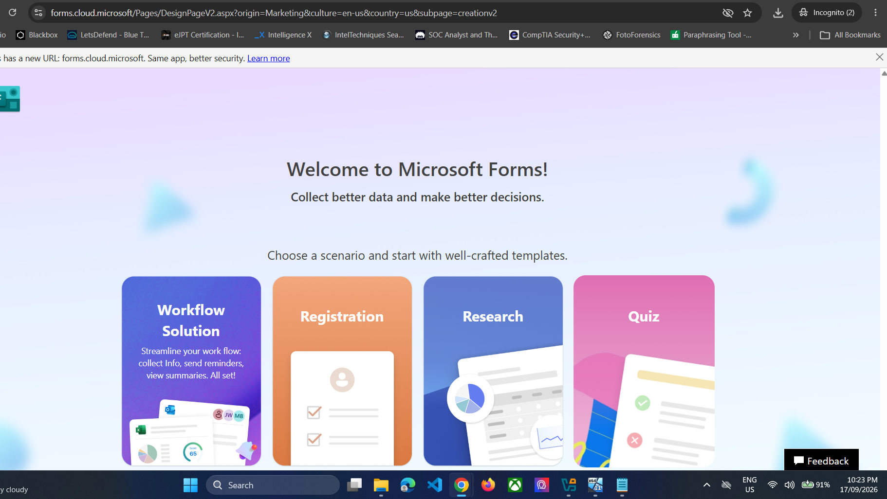
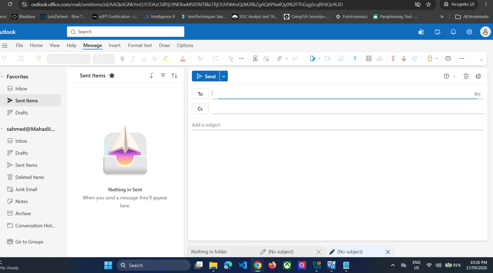
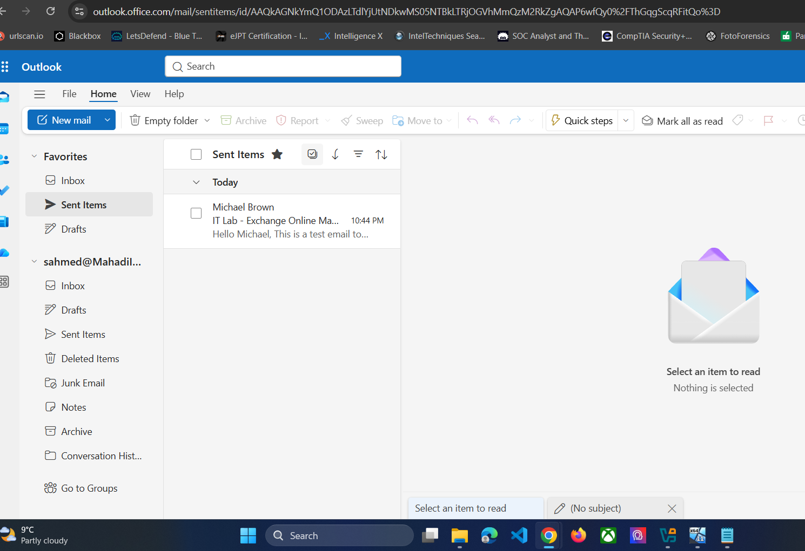
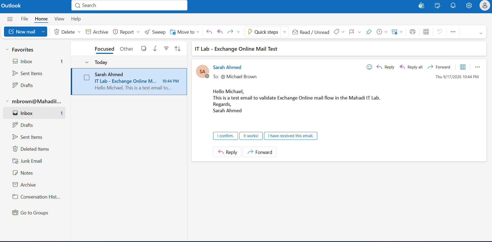
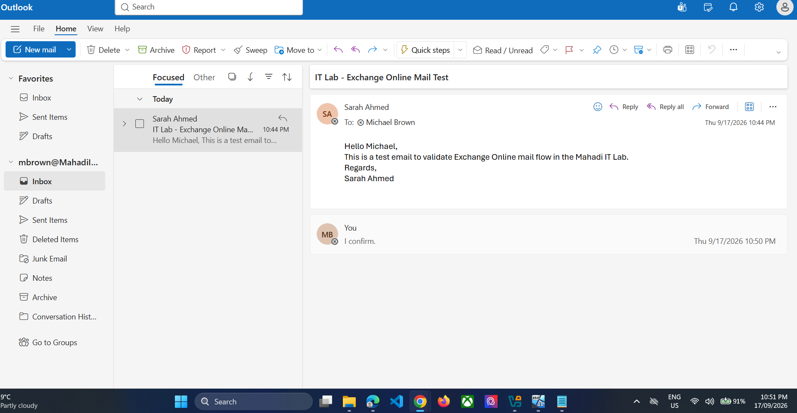
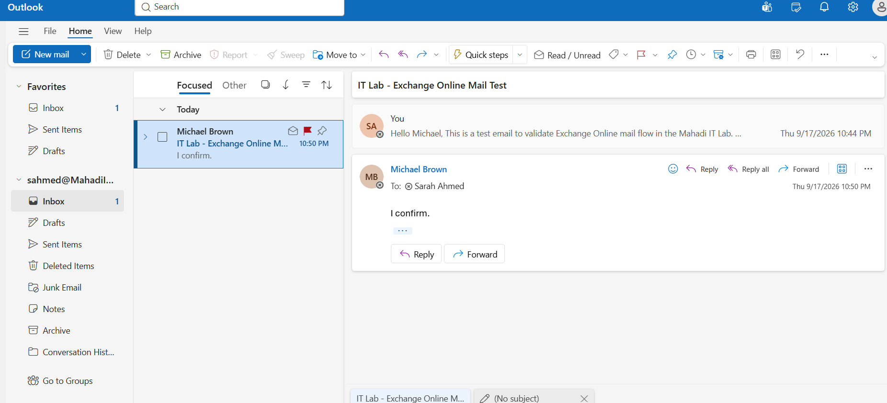
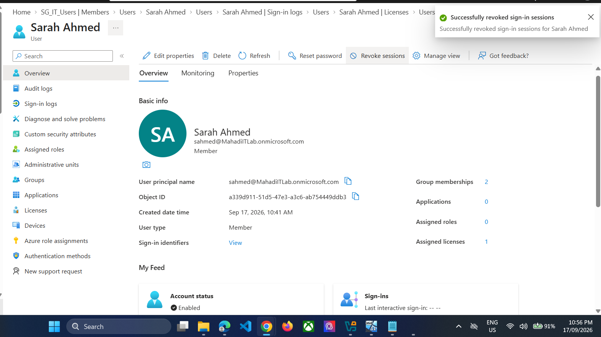
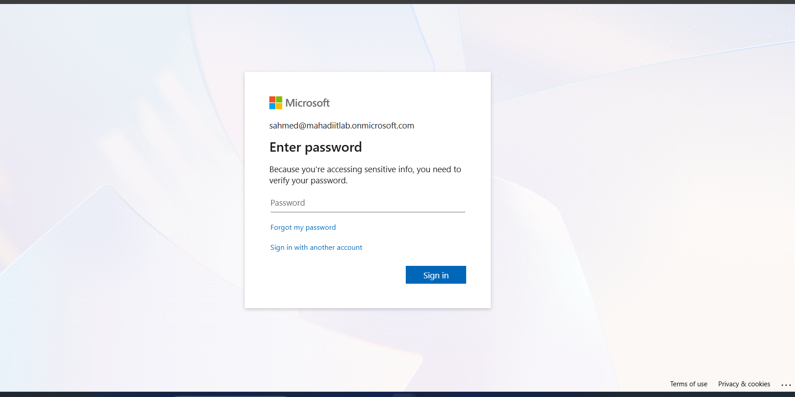

# 08 — Microsoft 365 Helpdesk Scenarios

## Objective
Practise common Service Desk workflows: password reset, sign-in investigation, licensing/service-plan troubleshooting, Exchange Online validation and session revocation.

## Scenario A — Password reset
1. Open Sarah Ahmed in Entra / Microsoft 365 admin.
2. Reset the password.
3. Give the temporary credential to the simulated user.
4. Validate successful sign-in.
5. Review Entra sign-in logs.

> **Publishing warning:** the raw password-reset screenshot contained a temporary password. The public version used in this repository is redacted.

*Evidence: password reset completed with the temporary password redacted.*

*Evidence: sign-in activity reviewed after remediation.*

## Scenario B — Microsoft 365 service-plan troubleshooting
Verify Business Premium licence and service plans.

Open **Manage apps & services** for the user.

A controlled Microsoft Forms access issue was reproduced by disabling the Forms service plan, then the service was restored.

## Scenario C — Exchange Online mail flow
Sarah opened Outlook on the web:

Sarah sent a test message to Michael Brown:

Michael received the email:

Michael replied:

The final thread confirmed two-way internal mail flow:

## Scenario D — Revoke sessions
From Sarah's Entra user page, select **Revoke sessions** and confirm.

Refresh the user's Microsoft 365 session. The user is required to enter the password again, confirming that the previous session was invalidated.

*Evidence: the user was forced to re-authenticate after session revocation.*

## Result
The lab covered realistic cloud Service Desk administration across identity, licensing, mail and session security.
