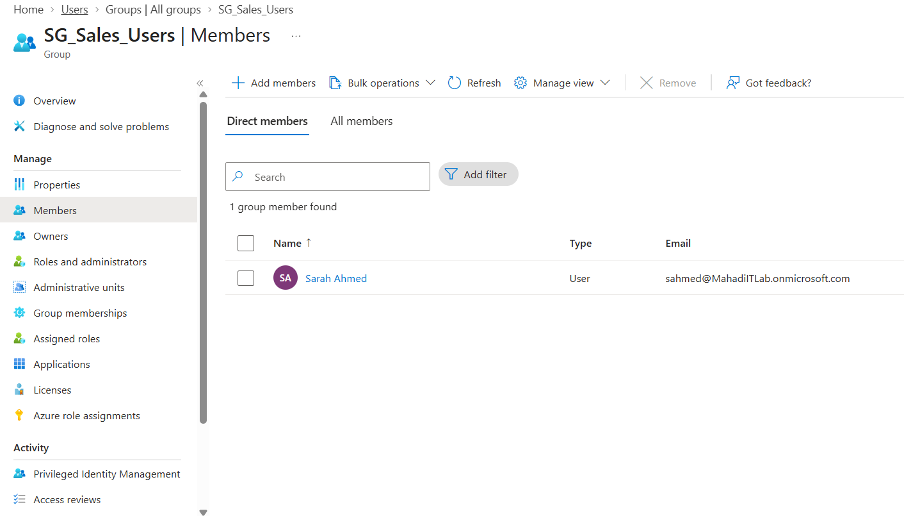
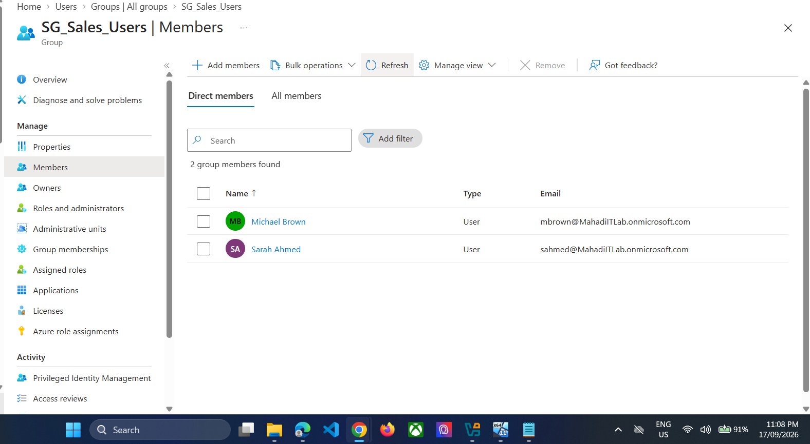
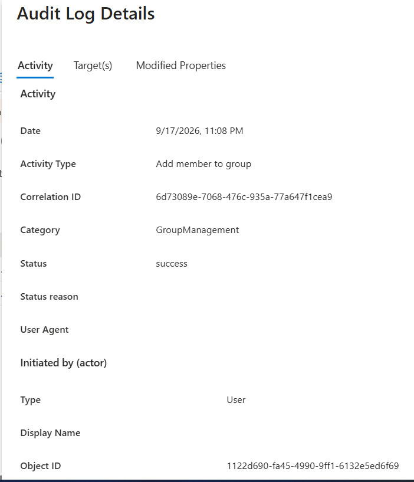
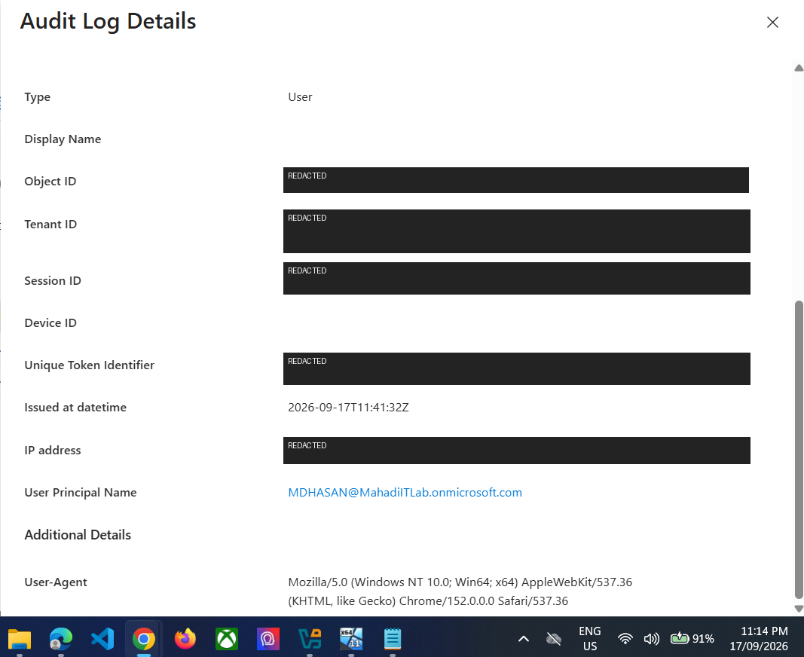
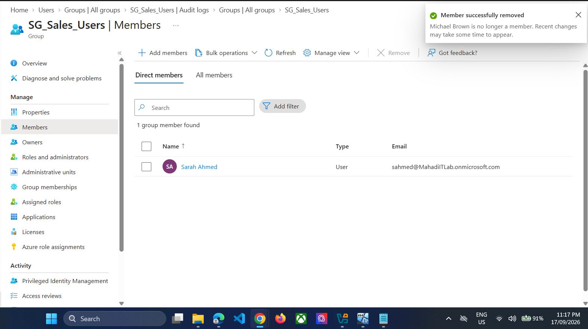
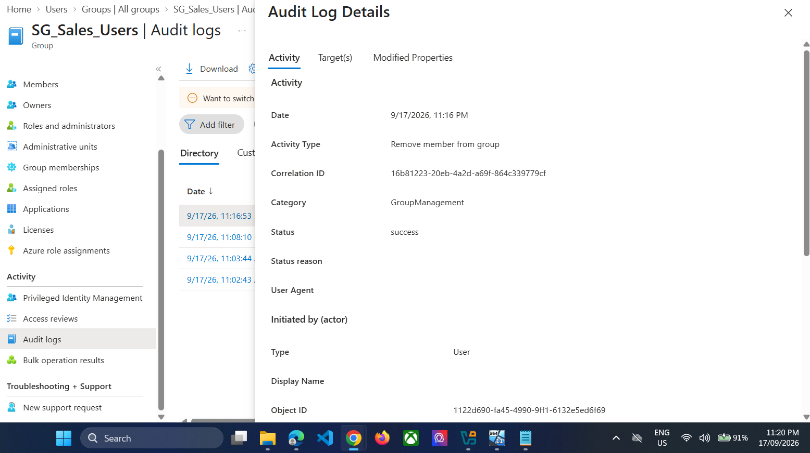
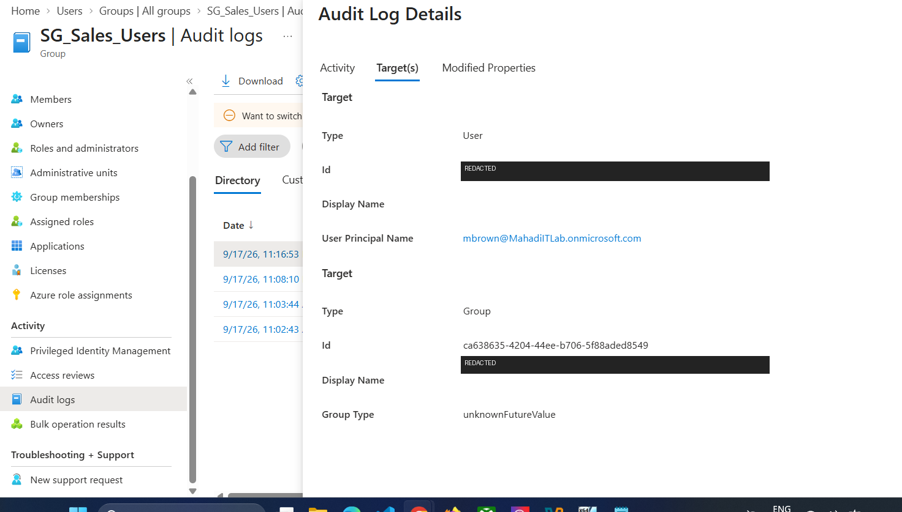

# 09 — Entra Group Access Lifecycle and Audit Logs

## Objective
Simulate a temporary access request, audit the administrative change, then revoke the access and restore least privilege.

## Initial state
Sarah Ahmed is the Sales user.

*Evidence: Original SG_Sales_Users membership.*

## Step 1 — Grant temporary access
Add Michael Brown to `SG_Sales_Users`.

*Evidence: Temporary Sales group access added.*

## Step 2 — Verify Add member audit event
Go to the group's **Audit logs**.

*Evidence: Add member to group audit activity.*

*Evidence: Administrator actor for the access change.*

> **Publishing warning:** crop or blur public IP addresses shown in audit details.

## Step 3 — Remove temporary access
Remove Michael Brown from `SG_Sales_Users`, leaving Sarah as the intended Sales member.

*Evidence: Temporary access removed and least privilege restored.*

## Step 4 — Verify Remove member audit event

*Evidence: Remove member from group audit activity.*

*Evidence: Audit target for removed membership.*

## Result
The complete access lifecycle was documented: request → grant → audit → revoke → audit → least-privilege restored.
