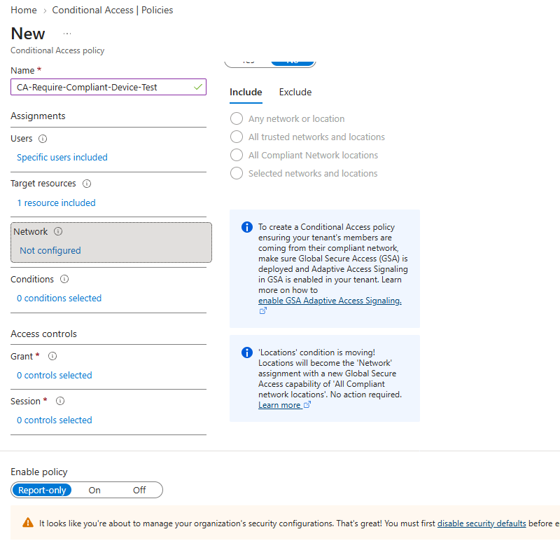
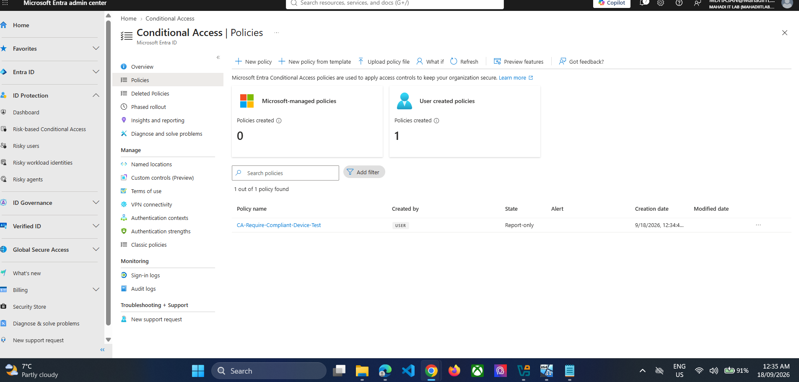
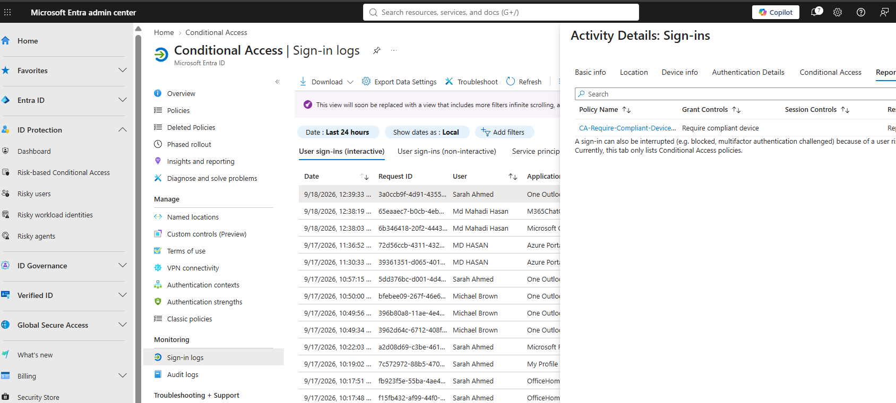

# 10 — Conditional Access with Compliant Device Requirement

## Objective
Create and safely validate a Conditional Access policy that requires a compliant device.

## Safety decision
The policy remained in **Report-only** mode. This allowed the lab to evaluate the policy without risking administrator or test-user lockout.

## Step 1 — Create policy
Name:
`CA-Require-Compliant-Device-Test`

Target:
- Specific test user
- Microsoft 365 / target cloud resource

Grant:
- **Require device to be marked as compliant**

Mode:
- **Report-only**

*Evidence: Conditional Access policy configured.*

## Step 2 — Verify policy exists in Report-only state

*Evidence: Conditional Access policy created in Report-only mode.*

## Step 3 — Generate a fresh user sign-in
Sign in from the compliant `INTUNE-W11` endpoint.

## Step 4 — Review Entra sign-in logs
Open the sign-in event → **Report-only** tab.

Expected result:
- Policy: `CA-Require-Compliant-Device-Test`
- Grant control: `Require compliant device`
- Result: **Report-only: Success**

*Evidence: Conditional Access Report-only Success.*

## Result
The compliant-device Conditional Access logic was successfully validated without enabling enforcement.
