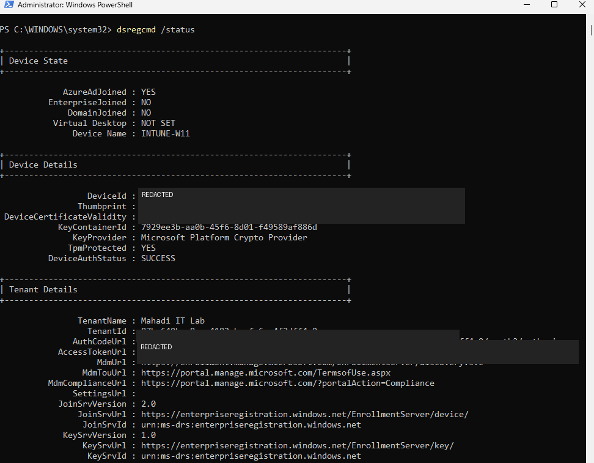
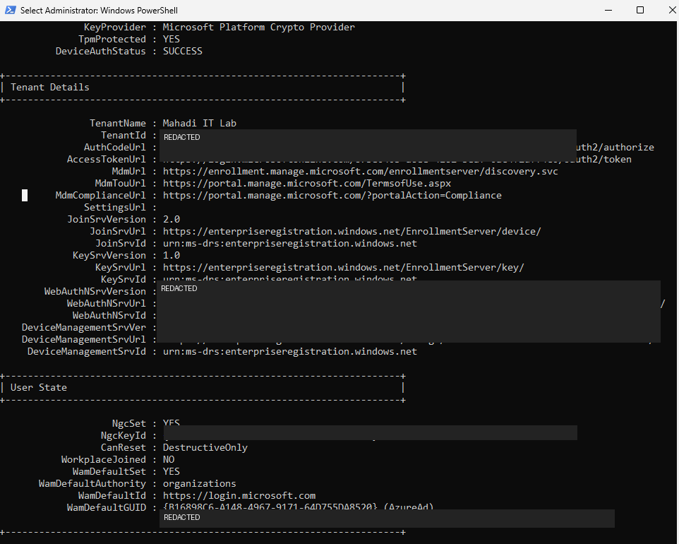
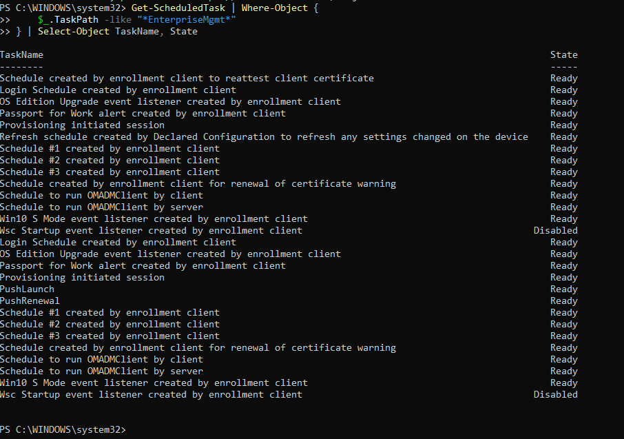
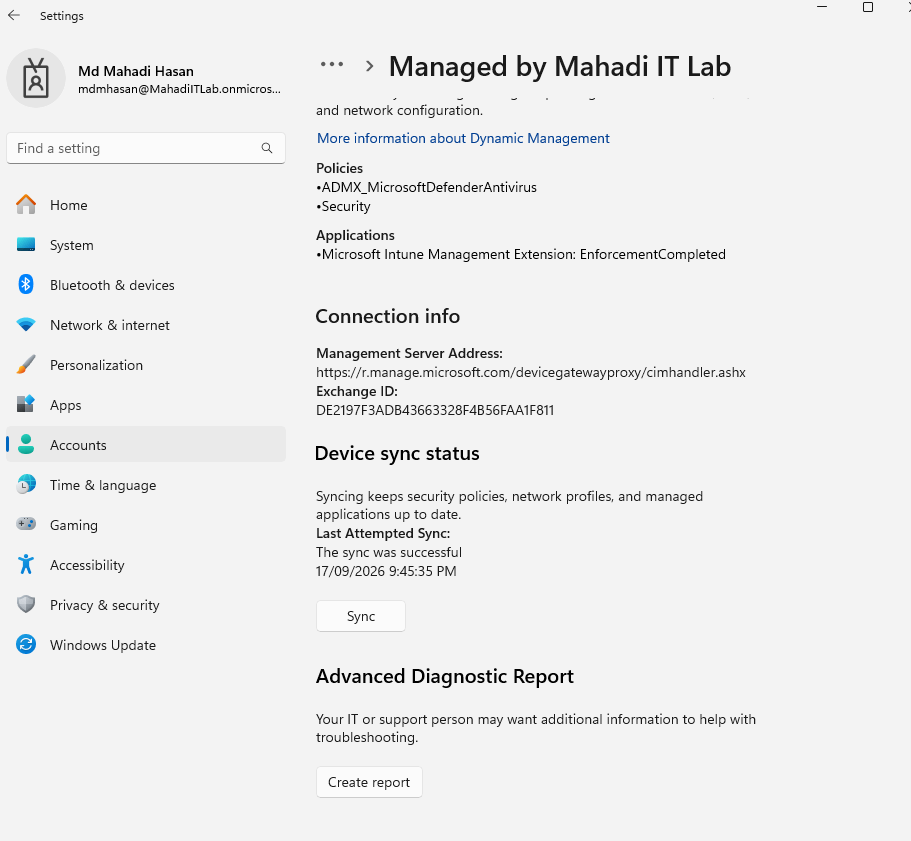

# 11 — Final Endpoint and MDM Validation

## Objective
Verify the Windows endpoint's Entra join, tenant registration, MDM enrollment and management tasks.

## Step 1 — Run dsregcmd
Open elevated PowerShell / Command Prompt:

```cmd
dsregcmd /status
```

Confirm:
- `AzureAdJoined : YES`
- Device name: `INTUNE-W11`
- Device authentication status: success
- Correct tenant
- MDM enrollment URLs present




*Evidence: dsregcmd device state.*




*Evidence: dsregcmd tenant and MDM information.*


## Step 2 — Verify EnterpriseMgmt scheduled tasks
PowerShell:

```powershell
Get-ScheduledTask | Where-Object {
    $_.TaskPath -like "*EnterpriseMgmt*"
} | Select-Object TaskName, State
```




*Evidence: Intune MDM EnterpriseMgmt scheduled tasks.*


## Step 3 — Manual work-account sync
Windows:
**Settings → Accounts → Access work or school → Info → Sync**




*Evidence: Successful manual MDM sync.*


## Final result
The cloud endpoint was Entra joined, Intune managed, compliant, receiving policy and app assignments, and communicating successfully with the MDM service.
