# Master Lab 1 — Complete Step-by-Step Documentation

## Enterprise Windows IT Support & Active Directory Home Lab

This archive reconstructs the lab from initial virtual-machine setup through final validation. It is written as a repeatable runbook: each section records the action, commands used where command-line work was actually performed, the observed result, and the associated screenshot evidence.

### Fidelity note

- GUI actions are documented as GUI steps; commands are **not invented** for steps that were completed through the interface.
- Where the lab clearly used a command, that command is included.
- A few optional PowerShell equivalents are labelled **Optional equivalent** and are not presented as commands that were necessarily used during the original run.
- The lab evidence comes from the screenshots preserved during the project.

### Lab identity

| Item | Value |
|---|---|
| Hypervisor | Oracle VirtualBox |
| Domain controller | `DC01` — Windows Server 2022 Standard Evaluation (Desktop Experience) |
| Client | `CLIENT01` — Windows 11 Pro |
| Domain | `adlab.local` |
| NetBIOS domain | `ADLAB` |
| Internal network | `192.168.10.0/24` |
| DC / DNS / DHCP | `192.168.10.10` |
| CLIENT01 lease | `192.168.10.100` |
| DC NAT address observed | `10.0.2.15` |

### Main AD objects

- User OUs: `ADLAB-Users\IT`, `ADLAB-Users\HR`, `ADLAB-Users\Sales`
- Computer OU: `ADLAB-Computers`
- Group OU: `ADLAB-Groups`
- Users: `mdmhasan` (IT), `sahmed` (Sales), `mbrown` (HR)
- Groups: `GG_IT_Users`, `GG_Sales_Users`, `GG_HR_Users`
- Shares: `C:\CompanyShares\IT`, `C:\CompanyShares\HR`, `C:\CompanyShares\Sales`

Open `MASTER-LAB-GUIDE.html` for the easiest offline reading experience, or read the numbered Markdown files in order.


---

# 1. Infrastructure and Virtual Machine Setup

## Step 1.1 — Create the Windows Server VM

1. In VirtualBox, create a Windows Server 2022 VM.
2. Install **Windows Server 2022 Standard Evaluation (Desktop Experience)**.
3. Complete the first boot and administrator setup.
4. Rename the server to `DC01` using **Server Manager → Local Server → Computer name**.
5. Restart when prompted.

**Observed result:** The server came online as `DC01` and was ready to be configured as the domain controller.

**Evidence — DC01 renamed and visible in Server Manager**

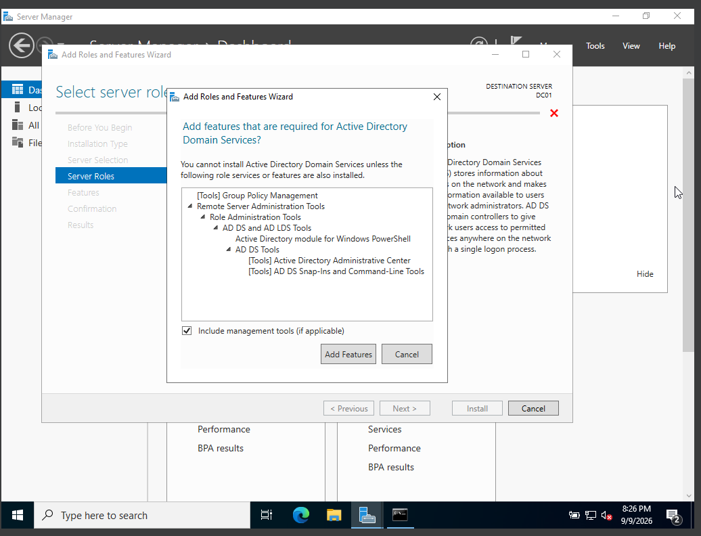


## Step 1.2 — Configure two network adapters on DC01

In VirtualBox, configure:

- **Adapter 1:** NAT — internet access.
- **Adapter 2:** Internal Network — name `ADLAB` — isolated domain traffic.

On Windows Server:

- NAT NIC (`Ethernet-Internet`) used the VirtualBox NAT network and had `10.0.2.15` during the lab.
- Internal NIC (`Ethernet-ADLAB`) was configured as `192.168.10.10/24`.
- DNS on the internal interface pointed to `192.168.10.10` after DNS/AD DS was available.

**Important final state:** DNS registration was disabled on the NAT-facing interface and enabled on `Ethernet-ADLAB` so the NAT IP would not pollute AD DNS.

**Evidence — DC01 NAT adapter configuration**

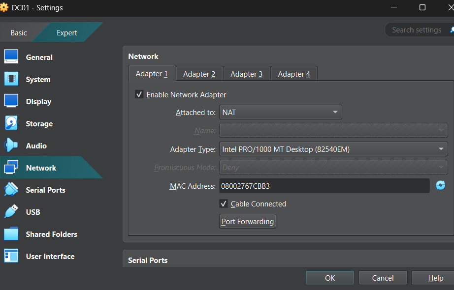


**Evidence — DC01 ADLAB internal adapter configuration**

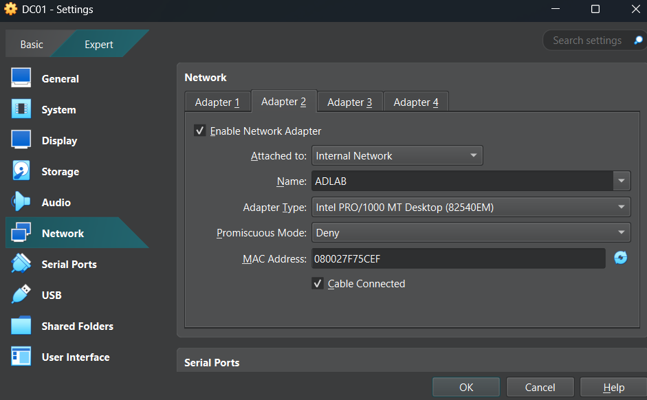


## Step 1.3 — Create the Windows 11 client VM

1. Create `CLIENT01` as a Windows 11 Pro VM.
2. Configure two NICs:
   - Adapter 1: NAT
   - Adapter 2: Internal Network `ADLAB`
3. The ADLAB adapter later received a DHCP lease from DC01.

**Observed result:** CLIENT01 could keep internet access through NAT while also participating in the isolated ADLAB domain network.

**Evidence — CLIENT01 dual-NIC configuration**

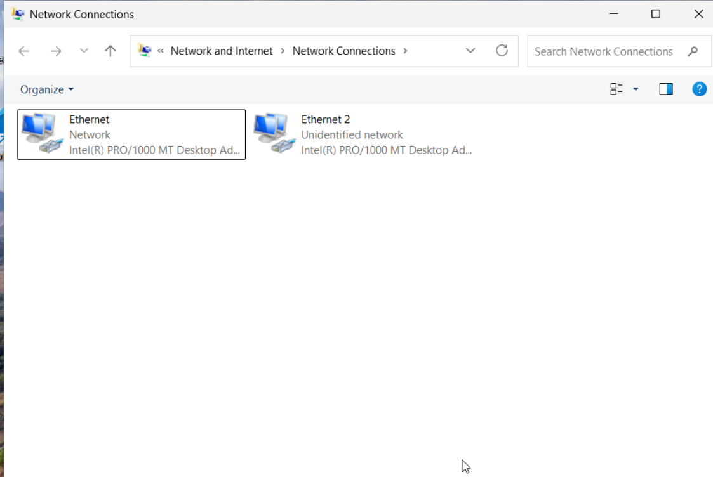


## Step 1.4 — Confirm server roles after build

By the completed state, DC01 hosted the required Windows Server roles for the lab, including AD DS, DNS and DHCP.

**Evidence — DC01 Server Manager roles**

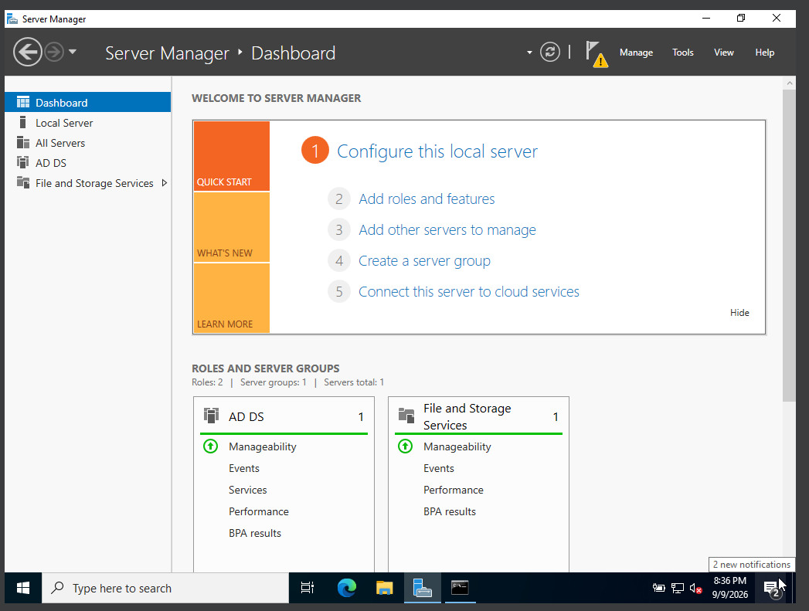


---

# 2. Active Directory Domain Services and Domain Join

## Step 2.1 — Install Active Directory Domain Services

On DC01:

1. Open **Server Manager → Add roles and features**.
2. Choose **Role-based or feature-based installation**.
3. Select the local server.
4. Select **Active Directory Domain Services** and accept required features.
5. Complete installation.

**Observed result:** AD DS installed successfully and Server Manager offered the promotion action.

**Evidence — Active Directory Domain Services role installed**


## Step 2.2 — Promote DC01 and create a new forest

1. Click the AD DS notification flag in Server Manager.
2. Select **Promote this server to a domain controller**.
3. Choose **Add a new forest**.
4. Root domain name: `adlab.local`.
5. Configure Directory Services Restore Mode password.
6. Continue through DNS/NetBIOS/path pages.
7. Verify prerequisites and install.

**Observed result:** Prerequisite checks passed, the server rebooted, and `DC01` became a writable domain controller for `adlab.local`.

**Evidence — New forest configured as adlab.local**


**Evidence — AD DS prerequisite check passed**


## Step 2.3 — Prepare CLIENT01 for the domain

Before joining the domain, the client needed to resolve the domain controller through AD DNS.

Validation commands used during the lab:

```cmd
ping dc01.adlab.local
nslookup dc01.adlab.local
```

**Observed result:** CLIENT01 could reach the DC and resolve the server name through the ADLAB network.

**Evidence — CLIENT01 reaching DC01 during DNS troubleshooting**


**Evidence — CLIENT01 resolving DC01 through DNS**


## Step 2.4 — Join CLIENT01 to adlab.local

1. On CLIENT01 open system/domain settings.
2. Change membership from workgroup to **Domain**.
3. Enter: `adlab.local`.
4. Provide domain administrator credentials.
5. Accept the welcome message and restart.

**Observed result:** CLIENT01 became a member computer of `adlab.local` and could authenticate domain users.

**Evidence — CLIENT01 domain join success**


---

# 3. Active Directory Organisational Structure, Users and Groups

## Step 3.1 — Create the OU structure

Using **Active Directory Users and Computers (ADUC)**, create:

```text
ADLAB-Users
├── IT
├── HR
└── Sales
ADLAB-Computers
ADLAB-Groups
```

Move `CLIENT01` into `ADLAB-Computers` so computer-targeted GPOs can be linked cleanly.

**Observed result:** Users, computers and security groups were separated into predictable administrative containers.

**Evidence — Active Directory OU structure**

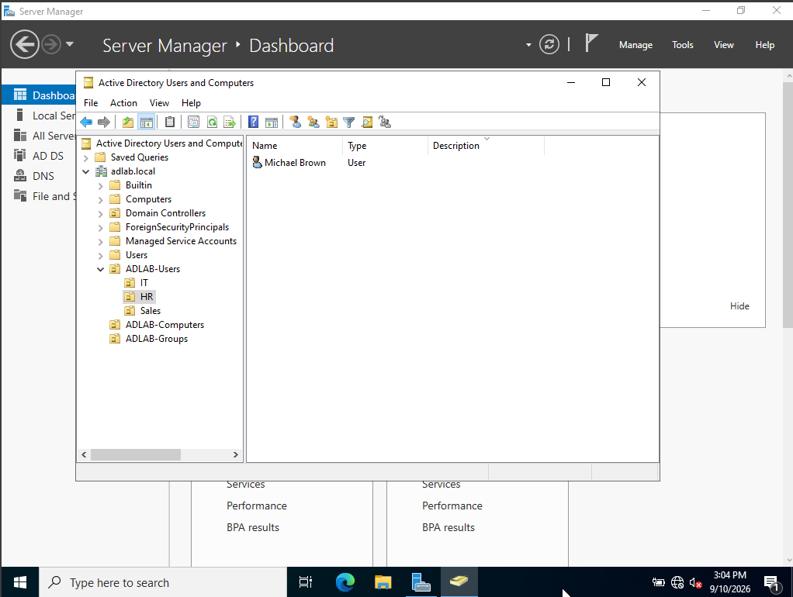


## Step 3.2 — Create department users

Create these lab accounts:

| Display name | Username | Department |
|---|---|---|
| Md Mahadi Hasan | `mdmhasan` | IT |
| Sarah Ahmed | `sahmed` | Sales |
| Michael Brown | `mbrown` | HR |

Each account was placed in the appropriate departmental OU.

## Step 3.3 — Create security groups

In `ADLAB-Groups`, create Global Security groups:

- `GG_IT_Users`
- `GG_HR_Users`
- `GG_Sales_Users`

Add department users to the matching group.

**Evidence — AD users and groups**

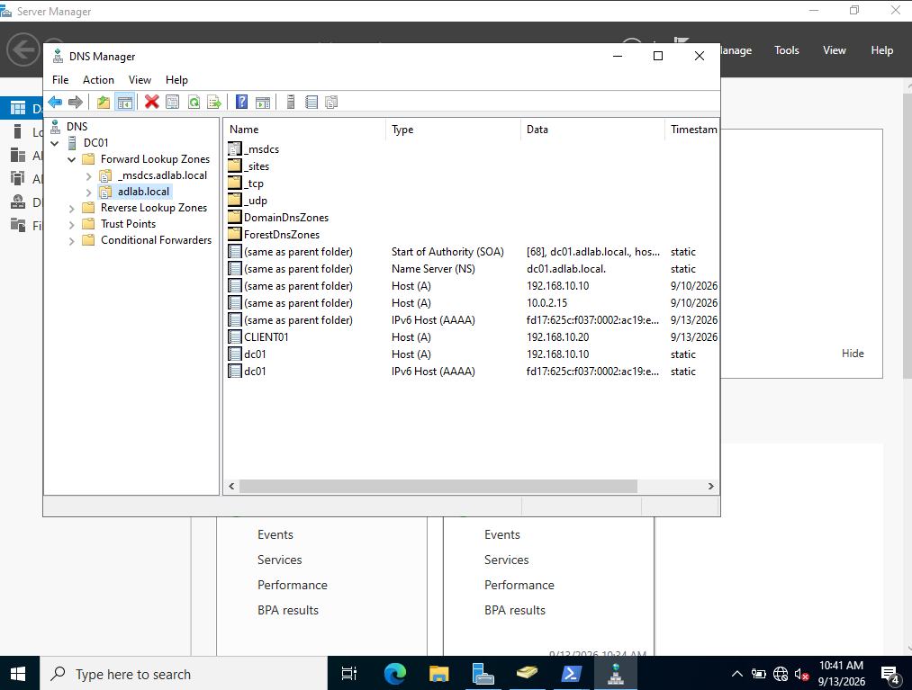


## Step 3.4 — Validate group membership

PowerShell/AD validation was used to confirm membership. A typical command used later in the lab was:

```powershell
Get-ADPrincipalGroupMembership -Identity mdmhasan | Select-Object Name
```

For a group-centric check:

```powershell
Get-ADGroupMember -Identity GG_Sales_Users
```

**Observed result:** Users belonged to their department group plus normal domain membership such as `Domain Users`.

**Evidence — Department security-group membership validation**

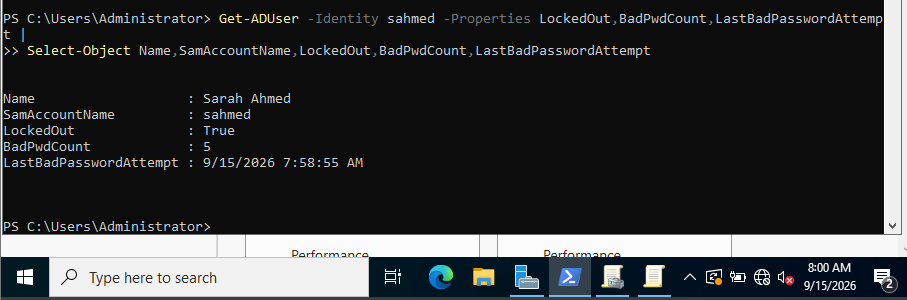


---

# 4. DNS, DHCP and Domain Networking

## Step 4.1 — Install and authorise DHCP

On DC01, install the **DHCP Server** role and complete post-install configuration so the server is authorised in Active Directory.

Create a scope for the ADLAB subnet:

- Network: `192.168.10.0/24`
- Lease range: `192.168.10.100` – `192.168.10.200`
- DNS server option: `192.168.10.10`
- Domain DNS suffix: `adlab.local`

**Observed result:** CLIENT01 received `192.168.10.100`, used DHCP server `192.168.10.10`, and used DNS server `192.168.10.10`.

**Evidence — DHCP server and scope configuration**

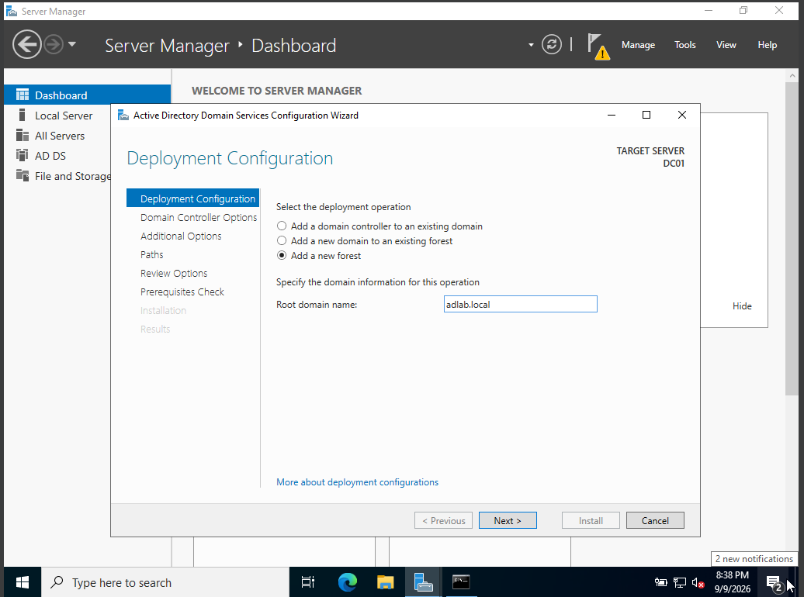


**Evidence — CLIENT01 DHCP, DNS and domain network state**


## Step 4.2 — Validate DNS records

DNS Manager was used to inspect the `adlab.local` forward lookup zone and the `dc01` record.

**Evidence — DC01 DNS record configuration**

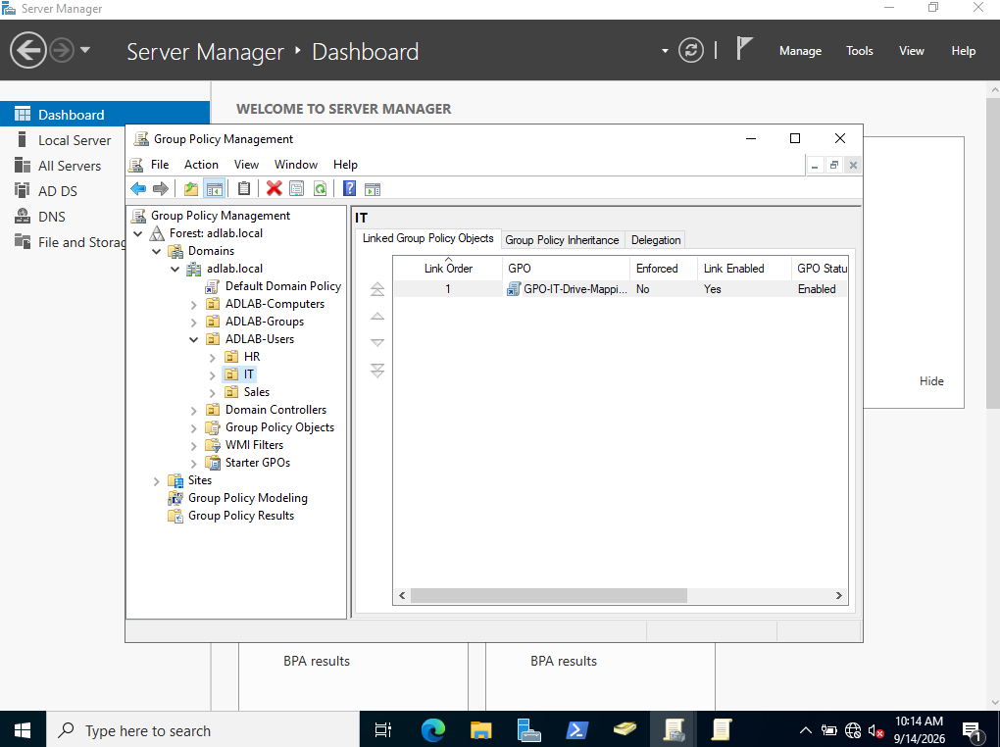


## Step 4.3 — Discover the domain controller

Command used on CLIENT01:

```cmd
nltest /dsgetdc:adlab.local
```

**Observed result:** The command found `\DC01.adlab.local` at `192.168.10.10` and returned AD service flags such as PDC, GC, LDAP, KDC, TIMESERV, WRITABLE and DNS.

**Evidence — Successful DC discovery with NLTEST**

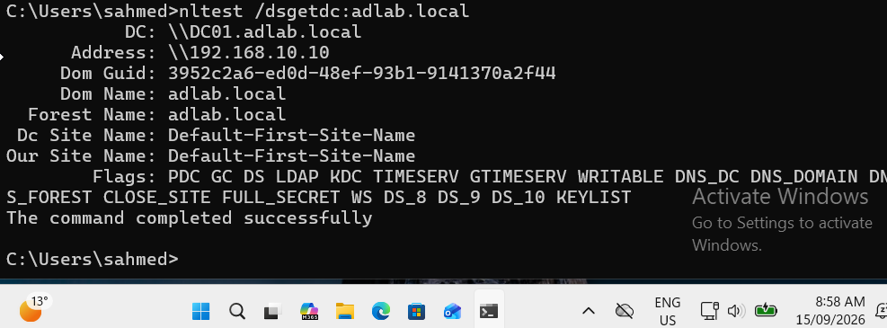


## Step 4.4 — Troubleshoot the stale NAT DNS record

### Problem observed

`dc01.adlab.local` could register the NAT-facing address `10.0.2.15` in addition to the intended internal address `192.168.10.10`. That is undesirable for domain clients.

### Interface registration check

PowerShell was used to inspect DNS client registration settings:

```powershell
Get-DnsClient | Select-Object InterfaceAlias, RegisterThisConnectionsAddress
```

Final desired state:

- `Ethernet-Internet` → `RegisterThisConnectionsAddress = False`
- `Ethernet-ADLAB` → `RegisterThisConnectionsAddress = True`

Set the internal NIC to register its address:

```powershell
Set-DnsClient -InterfaceAlias "Ethernet-ADLAB" -RegisterThisConnectionsAddress $true
```

The NAT interface remained non-registering.

### Remove the stale record

The stale `dc01` A record for `10.0.2.15` was removed from the `adlab.local` DNS zone. The lab used PowerShell for DNS resource-record cleanup; the equivalent targeted command is:

```powershell
Remove-DnsServerResourceRecord -ZoneName "adlab.local" -RRType "A" -Name "dc01" -RecordData "10.0.2.15" -Force
```

### Clear client cache and retest

On CLIENT01:

```cmd
ipconfig /flushdns
nslookup dc01.adlab.local
ping dc01.adlab.local
```

**Observed result:** DNS returned the intended internal address `192.168.10.10` (plus IPv6 where applicable), no longer the stale NAT IPv4 address. Ping resolved to `192.168.10.10` and succeeded 4/4.

**Evidence — PowerShell DNS cleanup evidence**

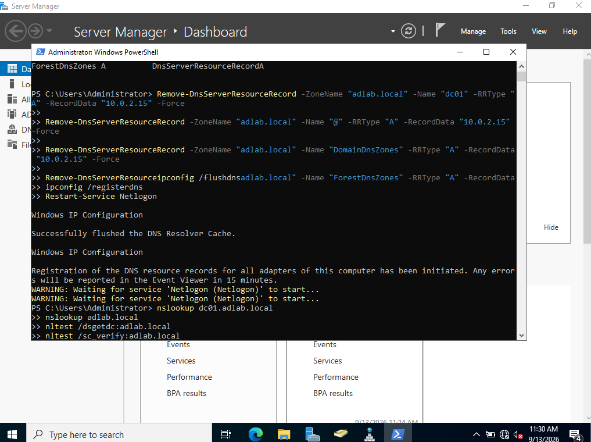


**Evidence — Final clean DC01 DNS validation**


> Note: `nslookup` displayed DNS server name as `UnKnown` because a reverse PTR record was not configured. Forward DNS and domain operations were still working correctly.


---

# 5. Group Policy and Endpoint Security

## Step 5.1 — Configure the domain account lockout policy

Edit **Default Domain Policy** under:

`Computer Configuration → Policies → Windows Settings → Security Settings → Account Policies → Account Lockout Policy`

Configured values:

- Account lockout threshold: **5 invalid logon attempts**
- Account lockout duration: **30 minutes**
- Reset account lockout counter after: **30 minutes**

**Observed result:** Five bad-password attempts could lock a domain account as designed.

**Evidence — Account lockout policy in Group Policy**

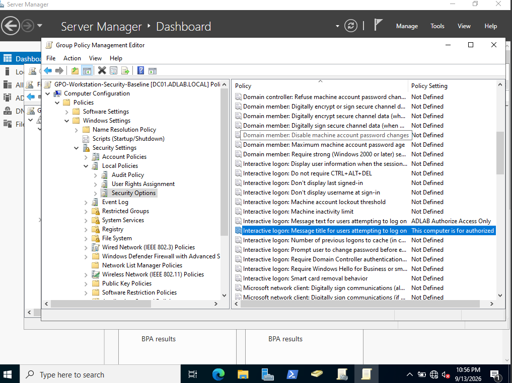


## Step 5.2 — Configure the user workplace GPO and Sales drive mapping

A user GPO named `GPO-User-Workplace-Setting` was linked to `ADLAB-Users`.

Drive mapping preference:

- Path: `\\DC01\Sales`
- Drive letter: `S:`
- Label: `Sales Department`
- Target: members of `GG_Sales_Users`

Use **Group Policy Preferences → Windows Settings → Drive Maps**.

**Evidence — GPO Sales drive mapping configuration**

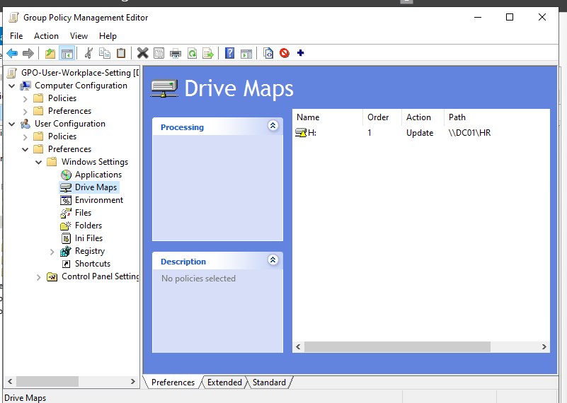


Use **Common → Item-level targeting** to target the Sales security group.

**Evidence — Security-group targeting for the Sales drive**

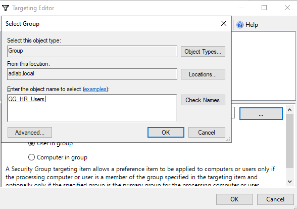


## Step 5.3 — Create a workstation security baseline

A computer GPO named `GPO-Workstation-Security-Baseline` was linked to `ADLAB-Computers`.

Controls configured/validated included:

- Interactive logon security banner.
- Microsoft Defender Firewall Domain Profile: **On**.
- Default inbound action: **Block**.
- Default outbound action: **Allow**.
- Microsoft Defender real-time protection enforced.
- Advanced logon auditing (covered in the auditing section).

## Step 5.4 — Enforce Microsoft Defender real-time protection

GPO path:

`Computer Configuration → Policies → Administrative Templates → Windows Components → Microsoft Defender Antivirus → Real-time Protection`

Set:

`Turn off real-time protection = Disabled`

That wording is intentional: **Disabled** means users/policy cannot turn real-time protection off through that setting.

**Evidence — GPO enforcing Defender real-time protection**

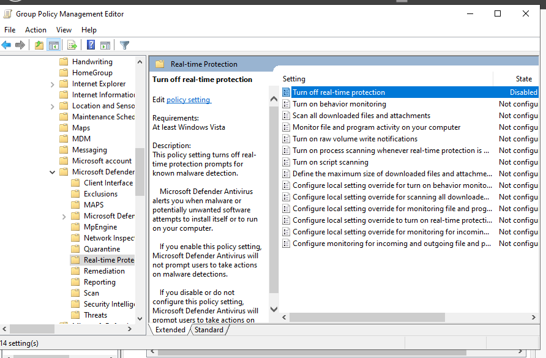


On CLIENT01, refresh policy:

```cmd
gpupdate /force
```

Then verify in PowerShell:

```powershell
Get-MpComputerStatus | Select-Object AntivirusEnabled, RealTimeProtectionEnabled
```

**Observed result:**

```text
AntivirusEnabled             True
RealTimeProtectionEnabled    True
```

**Evidence — Defender antivirus and real-time protection verified**

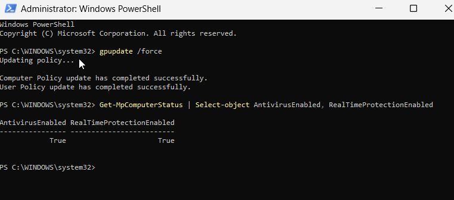


## Step 5.5 — Verify applied computer policy

On CLIENT01:

```cmd
gpupdate /force
gpresult /scope computer /r
```

**Observed result:** `GPO-Workstation-Security-Baseline` and `Default Domain Policy` were listed as applied. The computer DN showed `CLIENT01` in `OU=ADLAB-Computers`.

**Evidence — Final Group Policy validation on CLIENT01**


---

# 6. Department File Shares and Role-Based Access Control (RBAC)

## Step 6.1 — Create department folders

On DC01 create:

```text
C:\CompanyShares\IT
C:\CompanyShares\HR
C:\CompanyShares\Sales
```

Share each folder and use department AD groups for access control rather than assigning permissions user-by-user.

## Step 6.2 — Configure share and NTFS permissions

Apply least-privilege access so each department group has appropriate access only to its own share.

Example design:

- `GG_IT_Users` → IT share
- `GG_HR_Users` → HR share
- `GG_Sales_Users` → Sales share

Both share permissions and NTFS permissions were reviewed to ensure the effective permission model matched the intended RBAC design.

**Evidence — Server-side share permission configuration**

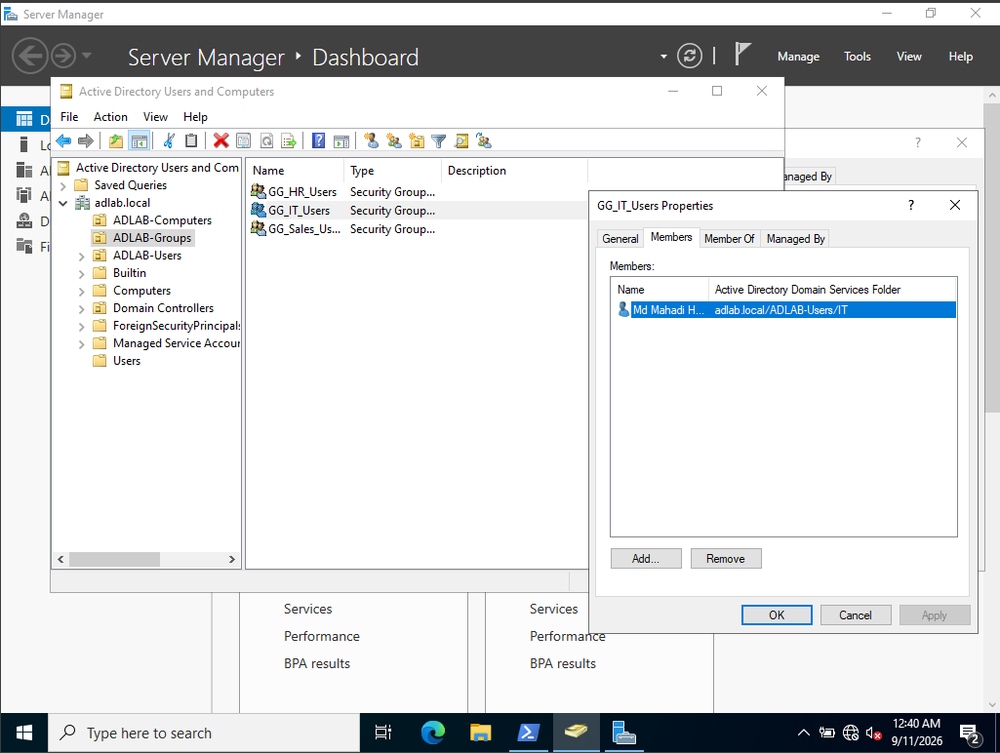


## Step 6.3 — Validate the Sales drive as Sarah

Log in to CLIENT01 as Sales user `ADLAB\sahmed`.

Commands used during final validation:

```cmd
whoami
net use
dir S:\
```

**Observed result:**

- `whoami` returned `adlab\sahmed`.
- `S:` mapped to `\\DC01\Sales`.
- The Sales content was accessible.

**Evidence — Sarah receiving the Sales S: drive**

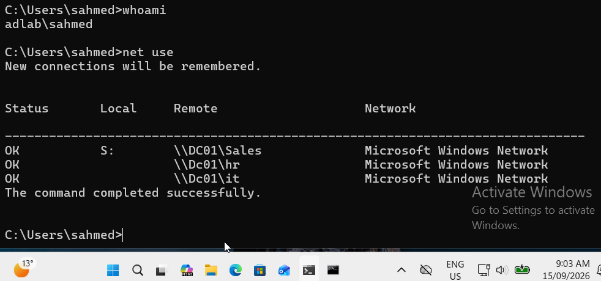


## Step 6.4 — Verify least privilege / access denied

From the same Sales session:

```cmd
dir \\DC01\HR
dir \\DC01\IT
```

**Observed result:** Both HR and IT access attempts returned **Access is denied**, while the Sales share remained accessible.

**Evidence — Sales user denied HR and IT shares**


**Evidence — End-to-end RBAC validation**

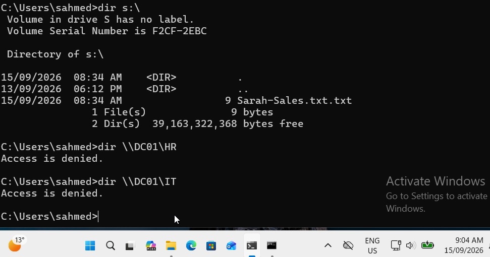


---

# 7. Account Lockout and Helpdesk Troubleshooting

## Step 7.1 — Generate a controlled account lockout

Using Sales user `sahmed`, intentionally submit an incorrect password five times to trigger the configured domain lockout policy.

## Step 7.2 — Diagnose the lockout in PowerShell

On DC01, inspect account state:

```powershell
Get-ADUser -Identity sahmed -Properties LockedOut,BadPwdCount,LastBadPasswordAttempt |
    Select-Object SamAccountName,LockedOut,BadPwdCount,LastBadPasswordAttempt
```

**Observed result:** The lab captured:

- `LockedOut = True`
- `BadPwdCount = 5`


**Evidence — Locked account detected after failed password attempts**


## Step 7.3 — Unlock the account

Command used:

```powershell
Unlock-ADAccount -Identity sahmed
```

Verify again:

```powershell
Get-ADUser -Identity sahmed -Properties LockedOut,BadPwdCount |
    Select-Object SamAccountName,LockedOut,BadPwdCount
```

**Observed result:** `LockedOut` changed to `False`, and Sarah could sign in successfully afterward.

**Evidence — PowerShell account-unlock workflow**


## Step 7.4 — Helpdesk lesson documented

This scenario demonstrated a common Service Desk workflow:

1. Confirm identity/account.
2. Check lockout status and bad-password count.
3. Unlock only when appropriate.
4. Confirm successful sign-in.
5. If repeated lockout occurs, investigate saved credentials, mapped drives, scheduled tasks or another source of bad-password attempts.


---

# 8. Advanced Audit Policy and Event Viewer Investigation

## Step 8.1 — Enable logon auditing

Edit the workstation security baseline:

`Computer Configuration → Policies → Windows Settings → Security Settings → Advanced Audit Policy Configuration → Audit Policies → Logon/Logoff`

Configure:

`Audit Logon = Success and Failure`

**Evidence — GPO advanced audit policy for logon success and failure**

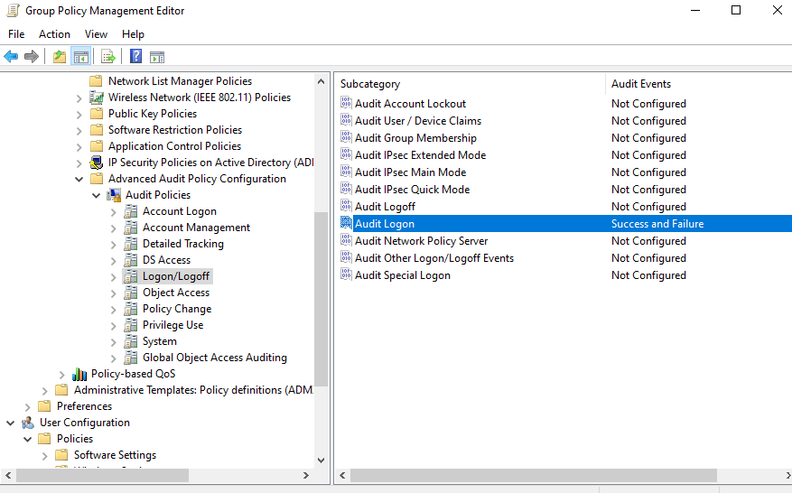


## Step 8.2 — Refresh and verify the policy on CLIENT01

Run:

```cmd
gpupdate /force
auditpol /get /subcategory:"Logon"
```

**Observed result:** The `Logon` subcategory showed **Success and Failure**.

**Evidence — CLIENT01 audit policy verification**

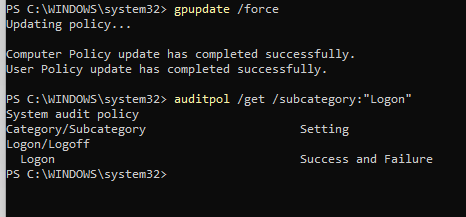


## Step 8.3 — Generate a controlled failed logon

1. Attempt one intentionally incorrect password for `sahmed`.
2. Then log in correctly.
3. Open Event Viewer with administrative privileges (a standard user could not read the Security log directly).
4. Navigate to **Windows Logs → Security**.
5. Filter for Event ID `4625`.

## Step 8.4 — Investigate Event ID 4625

The captured event showed:

- Event ID: `4625`
- Account Name: `sahmed`
- Account Domain: `ADLAB`
- Failure Reason: `Unknown user name or bad password`
- Computer: `CLIENT01.adlab.local`
- Audit result: Failure

**Observed result:** The failed authentication was visible and attributable to the intended lab account.

**Evidence — Event Viewer failed-logon investigation — Event ID 4625**


---

# 9. PowerShell Administration and Helpdesk Automation

## Step 9.1 — Work with AD users and groups

Commands used across the lab included:

```powershell
Import-Module ActiveDirectory
Get-ADGroupMember -Identity GG_Sales_Users
Get-ADPrincipalGroupMembership -Identity mdmhasan | Select-Object Name
```

These commands were used to verify group membership and support RBAC troubleshooting.

**Evidence — PowerShell AD user-health / membership work**

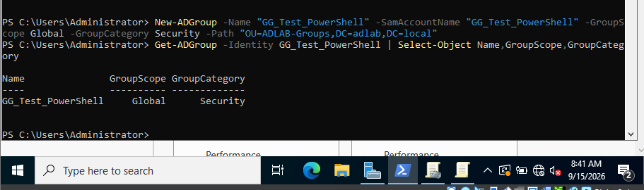


## Step 9.2 — Practice group lifecycle administration

A temporary security group named `GG_Test_PowerShell` was created, membership was tested, then it was cleaned up. The workflow used standard AD cmdlets:

```powershell
New-ADGroup -Name "GG_Test_PowerShell" -GroupScope Global -GroupCategory Security `
  -Path "OU=ADLAB-Groups,DC=adlab,DC=local"

Add-ADGroupMember -Identity "GG_Test_PowerShell" -Members mdmhasan
Get-ADGroupMember -Identity "GG_Test_PowerShell"
Remove-ADGroupMember -Identity "GG_Test_PowerShell" -Members mdmhasan -Confirm:$false
Remove-ADGroup -Identity "GG_Test_PowerShell" -Confirm:$false
```

**Observed result:** The temporary group and membership were successfully created, validated, removed and cleaned up.

**Evidence — PowerShell group-management practice**

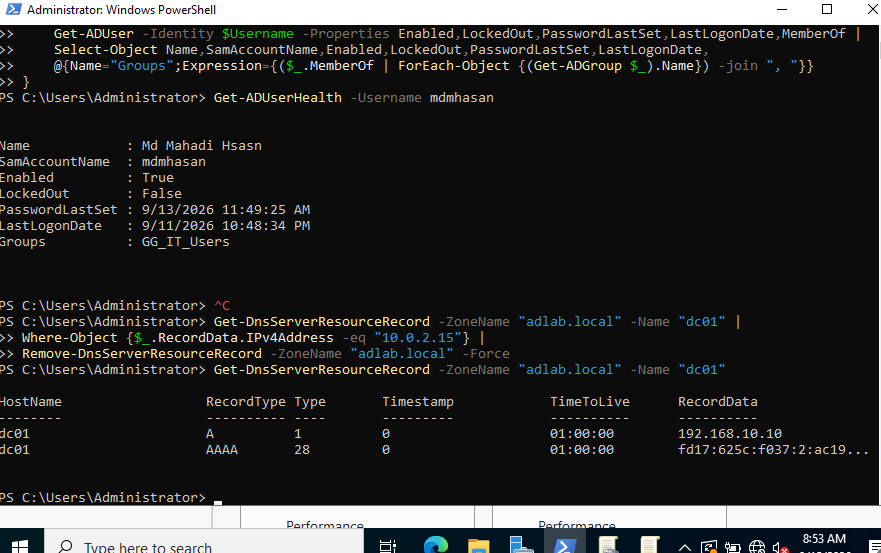


## Step 9.3 — Package common helpdesk tasks as functions

The final reusable script is saved in this archive as:

`../scripts/Helpdesk-AD-Toolkit.ps1`

Functions:

```text
Get-ADUserHealth
Unlock-HelpdeskUser
Get-DepartmentMembers
Get-FailedPasswordStatus
```

To load the script during the lab:

```powershell
Set-ExecutionPolicy -Scope Process Bypass -Force
. "C:\IT-Lab\Scripts\Helpdesk-AD-Toolkit.ps1"
```

Test command:

```powershell
Get-ADUserHealth -Username mdmhasan
```

**Observed result:** The function returned:

```text
Username        : mdmhasan
Enabled         : True
LockedOut       : False
PasswordLastSet : 9/13/2026 11:49:25 AM
LastLogonDate   : 9/11/2026 10:48:34 PM
Groups          : Domain Users, GG_IT_Users
```

**Evidence — Final PowerShell Helpdesk AD Toolkit output**


---

# 10. Final Health and End-to-End Validation

## Step 10.1 — Validate DNS and connectivity

On CLIENT01:

```cmd
ipconfig /flushdns
nslookup dc01.adlab.local
ping dc01.adlab.local
```

**Observed result:** `dc01.adlab.local` resolved to `192.168.10.10`, and ping completed successfully.

**Evidence — Final DNS and connectivity validation**


## Step 10.2 — Validate domain-controller discovery

```cmd
nltest /dsgetdc:adlab.local
```

Expected/observed target: `\DC01.adlab.local` on `192.168.10.10` with the appropriate AD service flags.

## Step 10.3 — Validate the secure channel

Run from an elevated command prompt:

```cmd
nltest /sc_verify:adlab.local
```

**Observed result:** The secure-channel verification returned `NERR_Success`.

**Evidence — Domain secure-channel verification**


**Evidence — Final secure-channel proof**


## Step 10.4 — Validate applied Group Policy

```cmd
gpupdate /force
gpresult /scope computer /r
```

**Observed result:**

- `GPO-Workstation-Security-Baseline` applied.
- `Default Domain Policy` applied.
- Policy source was `DC01.adlab.local`.
- CLIENT01 appeared under the `ADLAB-Computers` OU.

**Evidence — Final GPO validation**


## Step 10.5 — Final project acceptance criteria

The lab was considered complete after confirming all of the following:

- CLIENT01 had a valid DHCP lease on the ADLAB network.
- AD DNS resolved DC01 correctly without the stale NAT IPv4 record.
- The domain controller could be discovered.
- The domain secure channel was healthy.
- Required computer GPOs applied.
- Sales drive mapping worked for the Sales user.
- Sales user access to HR and IT was denied.
- Defender antivirus and real-time protection were enabled.
- Logon auditing was active and Event ID 4625 could be investigated.
- The PowerShell helpdesk toolkit executed successfully against Active Directory.


---

# Troubleshooting Log — Problems Encountered and Resolutions

## 1. Stale DC01 NAT IP in DNS

**Symptom:** `dc01.adlab.local` could resolve to the VirtualBox NAT IP `10.0.2.15` instead of the intended ADLAB address.

**Cause:** DNS registration on the wrong network interface.

**Resolution:** Keep NAT-interface DNS registration disabled, enable registration on the ADLAB interface, remove the stale A record, flush the client DNS cache and verify `192.168.10.10` resolution.

---

## 2. Sales account lockout

**Symptom:** `sahmed` could not sign in after repeated bad passwords.

**Diagnosis:** `LockedOut=True`, `BadPwdCount=5`.

**Resolution:** `Unlock-ADAccount -Identity sahmed`, then confirm `LockedOut=False` and successful login.

---

## 3. Department access denied

**Symptom:** Sales user received access denied for HR/IT paths.

**Interpretation:** This was the *expected* RBAC outcome, not a fault, because Sales should only access the Sales share.

**Validation:** `S:` and `\\DC01\Sales` worked; `\\DC01\HR` and `\\DC01\IT` returned Access is denied.

---

## 4. Security log access denied as a standard user

**Symptom:** Sarah's standard user account could not read the Security log.

**Resolution:** Open Event Viewer with administrative privileges and investigate Event ID 4625 there.

---

## 5. Copy/paste problems between host and CLIENT01

**Symptom:** Clipboard sharing in VirtualBox did not work reliably.

**Resolution:** Confirm **Shared Clipboard = Bidirectional**, insert the Guest Additions CD image and install **Oracle VirtualBox Guest Additions 7.1.8** on CLIENT01.

---

## 6. `nslookup` showed Server: UnKnown

**Symptom:** Forward lookup worked, but `nslookup` displayed the DNS server name as `UnKnown`.

**Cause:** No reverse PTR record for the DNS server.

**Decision:** Not a blocker for this lab; forward DNS, domain discovery and secure-channel checks were healthy.


---

# Command Cheat Sheet

## Client networking and DNS

```cmd
ipconfig /all
ipconfig /flushdns
nslookup dc01.adlab.local
ping dc01.adlab.local
nltest /dsgetdc:adlab.local
nltest /sc_verify:adlab.local
```

## Group Policy

```cmd
gpupdate /force
gpresult /scope computer /r
```

## RBAC / mapped drive validation

```cmd
whoami
net use
dir S:\
dir \\DC01\Sales
dir \\DC01\HR
dir \\DC01\IT
```

## Defender and auditing

```powershell
Get-MpComputerStatus | Select-Object AntivirusEnabled,RealTimeProtectionEnabled
```

```cmd
auditpol /get /subcategory:"Logon"
```

## Active Directory user/group checks

```powershell
Import-Module ActiveDirectory
Get-ADUser -Identity sahmed -Properties LockedOut,BadPwdCount,LastBadPasswordAttempt
Unlock-ADAccount -Identity sahmed
Get-ADGroupMember -Identity GG_Sales_Users
Get-ADPrincipalGroupMembership -Identity mdmhasan | Select-Object Name
```

## DNS-client registration / cleanup

```powershell
Get-DnsClient | Select-Object InterfaceAlias,RegisterThisConnectionsAddress
Set-DnsClient -InterfaceAlias "Ethernet-ADLAB" -RegisterThisConnectionsAddress $true
Remove-DnsServerResourceRecord -ZoneName "adlab.local" -RRType "A" -Name "dc01" -RecordData "10.0.2.15" -Force
```

## Helpdesk toolkit

```powershell
Set-ExecutionPolicy -Scope Process Bypass -Force
. "C:\IT-Lab\Scripts\Helpdesk-AD-Toolkit.ps1"
Get-ADUserHealth -Username mdmhasan
Unlock-HelpdeskUser -Username sahmed
Get-DepartmentMembers -GroupName GG_Sales_Users
Get-FailedPasswordStatus -Username sahmed
```
